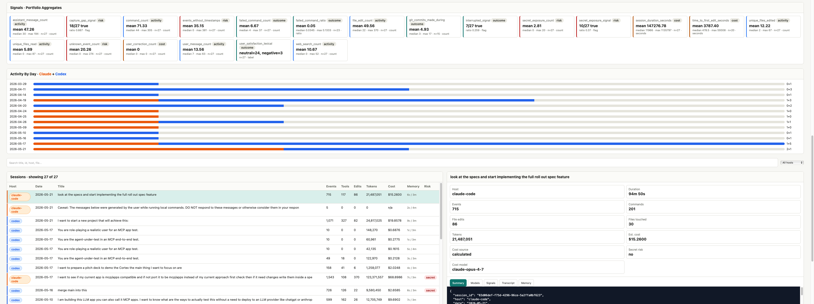

# retro


Capture **Codex** and **Claude Code** rollouts into durable local artifacts, evaluate them with signals, mine them into prompt-time memory, and report on cost and behavior via a static dashboard. Local-first, no cloud, evidence-linked.

Project wiki and onboarding guides: <https://sajjadgg.github.io/retro/>

This project answers two questions that "another memory store" doesn't:

1. **How did this rollout actually go?** (signals: activity, outcome, cost, risk)
2. **What can the next session reuse from it?** (mining: skills, procedures, failure triggers)

The full design is split across specs in [`specs/`](specs/). The headline ones:

- [`full_rollout_capture_feature_spec.md`](specs/full_rollout_capture_feature_spec.md) — the capture contract.
- [`rollout_signals_spec.md`](specs/rollout_signals_spec.md) — what signals are and how they aggregate.
- [`rollout_mining_methods.md`](specs/rollout_mining_methods.md) — the catalog of mining methods.
- [`memory_storage_backend_spec.md`](specs/memory_storage_backend_spec.md) — SQLite memory index over flat files.
- [`rollout_dashboard_spec.md`](specs/rollout_dashboard_spec.md) — the dashboard.
- [`ccusage_comparison_spec.md`](specs/ccusage_comparison_spec.md) — gap analysis vs. ccusage.

---

## Table of contents

- [Install](#install)
- [Architecture at a glance](#architecture-at-a-glance)
- [Storage layout](#storage-layout)
- [Capture](#capture)
- [Signals](#signals)
- [Mining](#mining)
- [Memory backend](#memory-backend)
- [Dashboard](#dashboard)
- [Pricing snapshot](#pricing-snapshot)
- [Release and publishing](#release-and-publishing)
- [Environment](#environment)
- [Notes and guarantees](#notes-and-guarantees)

---

## Install

Requires Python ≥ 3.10.

From PyPI:

```bash
pip install retro-agent-memory
```

That installs the `retro` CLI.

From a clone:

```bash
python3.13 -m venv .venv
.venv/bin/pip install -e .
```

The PyPI distribution is named `retro-agent-memory` because `retro` is already occupied on PyPI; the import package and CLI are still named `retro`.

---

## Architecture at a glance

```
                  ┌──────────────────────────────────────────────────────────┐
                  │                       retro CLI                       │
                  ├──────────────┬─────────────┬──────────────┬───────────┤
   ~/.claude  ──▶ │  importers   │   signals   │    mining    │  memory   │
   ~/.codex   ──▶ │  (claude,    │  (heuristic │  (4 methods, │  index    │
                  │   codex)     │  + external)│  + filters)  │  + weave  │
                  └──────┬───────┴──────┬──────┴───────┬──────┴─────┬─────┘
                         ▼              ▼              ▼            ▼
                       raw/        normalized/      mined/      memories/
                  (immutable)    (events.jsonl)   (per method) (files + SQLite)
                         │
                         ▼
                     rendered/   ← markdown view (any time)
                         │
                         ▼
                    dashboard/build_dashboard.py
                  (static HTML + KPIs + per-model cost + signals + drill-down)
```

Each stage is independent — you can re-render markdown, recompute signals, re-mine, rebuild the memory index, or rebuild the dashboard from whatever `rollout-memory/` already has on disk.

---

## Storage layout

Artifacts land in `./rollout-memory/` by default:

```
rollout-memory/
  raw/<host>/<session-id>/                   # immutable copies of source jsonl + metadata + sidecars
    transcript.jsonl        (claude)
    rollout.jsonl           (codex)
    import_meta.json        (claude)         # source path, project_slug, claude_home, …
    thread.json             (codex)          # cwd, model_provider, source_kind, spawn_edges, …
    sidecars/               (claude todos/tasks if present)

  normalized/<host>/<session-id>.events.jsonl  # one normalized event per line

  rendered/<host>/<session-id>.md             # human-readable markdown view

  mined/<method>/<host>/<session-id>.json     # mined candidates (structured)
  mined/<method>/<host>/<session-id>.prompt.md  # paste-ready prompt block

  signals/
    readings.jsonl                            # one row per (session, signal)
    aggregates.json                           # rolled-up stats per signal
    summary.md                                # human view

  memories/
    items.jsonl                               # canonical appended memory records
    events.jsonl                              # memory lifecycle / utility log
    index.sqlite                              # derived SQLite + FTS index, rebuildable
```

`raw/` is treated as **immutable**: re-importing the same session refuses unless `--force` is passed.

---

## Capture

Discovery merges both Claude default roots and honors comma-separated overrides — same behavior as ccusage.

| Host       | Default roots                                       | Env override          |
| ---------- | --------------------------------------------------- | --------------------- |
| Claude Code| `~/.claude/projects/` and `~/.config/claude/projects/` | `CLAUDE_CONFIG_DIR` |
| Codex      | `~/.codex` (uses `state_5.sqlite.threads.rollout_path`) | `CODEX_HOME`      |

Codex roots are auto-classified:
- **sqlite_home**: has `state_5.sqlite` → discovery via SQLite (preserves spawn-edge graph).
- **sessions_dir**: has a `sessions/` subdir but no SQLite → scan `*.jsonl`.
- **jsonl_dir**: neither → treat the directory as a flat JSONL bag (e.g. `codex exec --json` output).

### Commands

```bash
# Discover what's available on this machine
retro list                           # both hosts, with retention warning for old Claude logs
retro list --host claude
retro list --host codex
retro list --limit 50

# Import a single session
retro import claude --session-id <session-id>
retro import codex  --thread-id  <thread-id>
retro import claude --latest         # most-recent
retro import codex  --latest

# Import every discoverable session
retro import all                     # both hosts
retro import claude --all
retro import codex  --all
retro import all --limit-per-host 20

# Force overwrite an existing capture
retro import claude --latest --force

# Skip the markdown re-render step
retro import codex --latest --no-render

# Re-render markdown from an already-imported normalized stream
retro render claude <session-id>
retro render codex  <thread-id>

# Inspect what got captured
retro show claude <session-id>
retro show codex  <thread-id>
```

### Multi-root example

```bash
# Pull in Claude logs from two locations:
CLAUDE_CONFIG_DIR="$HOME/.claude,$HOME/.config/claude,/backup/claude-archive" retro import claude --all

# Codex saved via `codex exec --json` (no SQLite present):
CODEX_HOME="$HOME/.codex,$HOME/codex-exec-logs" retro import codex --all
```

### Retention warning

When the oldest discoverable Claude transcript is **more than 25 days old**, `retro list` prints a yellow warning. Claude Code retains logs for ~30 days by default — capture older sessions before they age out, or raise `cleanupPeriodDays` in Claude settings.

---

## Signals

Signals are evaluators that observe a captured rollout and emit a comparable reading (numeric / boolean / categorical). They answer: *"how did this rollout go, by some objective measure?"*

Signals are grouped by intent, not implementation:

| Group      | Question answered                       | Examples |
| ---------- | --------------------------------------- | -------- |
| `activity` | What did the agent do?                  | `command_count`, `unique_files_edited`, `web_search_count` |
| `outcome`  | Did the work land?                      | `git_commits_made_during`, `failed_command_ratio`, `user_satisfaction_lexical` |
| `cost`     | What did it cost (effort/tokens/time)?  | `session_duration_seconds`, `user_correction_count`, `time_to_first_edit_seconds` |
| `risk`     | How trustworthy was the capture/work?   | `unknown_event_count`, `capture_gap_signal`, `secret_exposure_signal` |

Methods: `heuristic` (pure event walk), `regex` (text patterns), `external` (touches the world — e.g. `git log`). `llm_judge` is reserved for later.

### Commands

```bash
# Inventory of registered signals
retro signal list
retro signal list --group outcome

# Compute signals for every imported session
retro signal run

# Restrict scope
retro signal run --host claude
retro signal run --host codex --session-id <id>
retro signal run --signal git_commits_made_during,failed_command_ratio

# Inspect readings for one session
retro signal show claude <session-id>
retro signal show codex  <thread-id>
```

### Output

- `rollout-memory/signals/readings.jsonl` — one row per `(session, signal)` reading.
- `rollout-memory/signals/aggregates.json` — per-signal cross-session aggregates (mean / median / p90 / sum / histogram).
- `rollout-memory/signals/summary.md` — human view.

Each reading carries `evidence_refs` (event_ids), `confidence`, and a `method` tag so it can be traced back to the rollout. External signals (e.g. `git_commits_made_during`) emit a `null` reading with a `reason` field when their context is missing (cwd gone, not a git repo) rather than silently skipping.

### Adding a new signal

```python
from retro.signals.base import SessionContext, reading, register

@register("my_signal", group="outcome", kind="boolean",
          method="heuristic", description="…")
def _my_signal(ctx: SessionContext):
    return reading(ctx, _my_signal, value=True, evidence=[some_event])
```

`retro signal list`/`run`/`show` and the dashboard pick it up automatically.

---

## Mining

Mining turns captured rollouts into **prompt-time memory candidates** — paste-ready blocks for the next session. Multiple methods are registered; each produces the same `MemoryCandidate` shape so they compose. Filters run after methods to prune unsafe / redundant candidates.

### Registered methods

| Method            | What it produces                                                                              | Source paper |
| ----------------- | --------------------------------------------------------------------------------------------- | ------------ |
| `reme_refine_poc` | Success patterns, failure triggers, tool lessons, risk rules.                                 | [ReMe](https://arxiv.org/abs/2512.10696) |
| `skill_pro`       | Reusable skills with explicit `activation` / `steps` / `termination` / `verification` blocks. | [Skill-Pro](https://arxiv.org/abs/2602.01869) |
| `memp_procedural` | Whole-session procedural memory: `goal` / `preconditions` / `steps` / `warnings` / `outcome`. | [Memp](https://arxiv.org/abs/2508.06433) |
| `codex_headless`  | LLM-backed extraction through `codex exec --json`; saves the headless Codex JSONL capture.     | local Codex CLI |

### Registered filters

| Filter       | What it does                                                                              |
| ------------ | ----------------------------------------------------------------------------------------- |
| `risk_aware` | Drops `risk=high` and low-confidence candidates, dedupes near-duplicates, caps at 8 items. |

The default methods are **deterministic and local**. `codex_headless` is opt-in and calls `codex exec --json` on a compact, redacted rollout summary. It writes the Codex headless stream to `rollout-memory/headless/codex_headless/<host>/<session-id>.codex.jsonl`.

### Commands

```bash
# Inventory
retro methods

# Single method, single session (default method is reme_refine_poc)
retro mine codex <thread-id>
retro mine claude <session-id> --method skill_pro
retro mine codex  <thread-id>  --method memp_procedural
retro mine codex  <thread-id>  --method codex_headless

# Run every registered method on one session
retro mine codex <thread-id> --method all

# Apply one or more filters after mining
retro mine codex <thread-id> --method skill_pro --filter risk_aware
retro mine codex <thread-id> --method all       --filter risk_aware

# Bulk mine
retro mine '*' '*' --method all --filter risk_aware
retro mine codex  '*' --method skill_pro
retro mine claude '*' --method memp_procedural --all
```

### Output

For each `(method, host, session_id)`:

- `rollout-memory/mined/<method>/<host>/<id>.json` — full structured result (candidates, structured payloads, evidence refs, notes, filters applied).
- `rollout-memory/mined/<method>/<host>/<id>.prompt.md` — paste-ready memory block tagged with `<retro method="…">`, sorted by priority and confidence.

### Example skill_pro output

```text
Skill: investigate and patch a bug
  Activation: gi ahead and fix the issues found here
  Steps:
    1. TaskCreate (Scan both ~/.claude/projects/ and ~/.config/claude/projects/…)
    2. read file (file_path=~/…/retro/importers/claude.py)
    3. edit file (file_path=~/…/retro/importers/claude.py)
    …
  Termination: after writing ~/…/Mem/specs/ccusage_comparison_spec.md
  Verification: (no explicit verification observed)
```

### Adding a new method

```python
# src/retro/mining/methods/my_method.py
from ..base import MiningContext, MiningResult, MemoryCandidate, register_method, memory_id

@register_method("my_method", description="…")
def mine_my_method(ctx: MiningContext) -> MiningResult:
    candidates = [
        MemoryCandidate(
            id=memory_id(ctx.session_id, "my_method", 1),
            method="my_method",
            kind="procedure",
            text="…",
            when_to_use="…",
            evidence_refs=[ev.event_id for ev in ctx.events[:3]],
            confidence=0.6,
            priority=4,
        )
    ]
    return MiningResult(
        session_id=ctx.session_id, host=ctx.host, method="my_method",
        task_summary=ctx.task_summary(), candidates=candidates,
    )
```

Import it in `mining/methods/__init__.py`. `retro methods` and `--method` pick it up.

---

## Memory backend

The memory backend turns mined and authored memories into a local SQLite index. Flat files remain the source of truth; `index.sqlite` is a derived cache that can be deleted and rebuilt.

The index currently supports:

- SQLite schema bootstrap with FTS5 keyword recall.
- Reindexing from `rollout-memory/memories/items.jsonl` and existing mined artifacts.
- `[[wiki-link]]` edge extraction and one-hop linked-memory expansion.
- Authored markdown import with simple frontmatter.
- Keyword retrieval with scope/repo filtering and value-aware reranking.
- Utility updates through `memories/events.jsonl`.
- Prompt-time context weaving.
- Dashboard counts for indexed memory, status/scope/kind, top utility, and lifecycle events.

### Commands

```bash
# Create rollout-memory/memories/ and an empty index
retro memory init

# Rebuild index.sqlite from files and mined artifacts
retro memory reindex

# Inspect index counts and dangling wiki-links
retro memory doctor

# Import hand-authored markdown memories
retro memory import-authored ~/path/to/memory-notes

# Retrieve ranked memories; include candidates by default while promotion matures
retro memory retrieve --query "pytest retrieval" --cwd /path/to/repo
retro memory retrieve --query "pytest retrieval" --cwd /path/to/repo --accepted-only

# Emit a compact prompt block
retro memory weave --query "pytest retrieval" --cwd /path/to/repo

# Update observed utility after a memory is used
retro memory update-utility --memory-id <id> --reward 0.8 --session-id <session-id>
```

### Authored markdown

Authored memories are normal markdown files. Frontmatter is optional; missing fields get conservative defaults.

```markdown
---
id: pytest-policy
kind: tool_lesson
scope: global
status: accepted
risk: low
when_to_use: Use when editing tests.
---
Run pytest after changing retrieval. Link to [[debugging-policy]] when relevant.
```

Accepted memories that contain prompt-injection markers, credential-looking strings, or invisible control characters are downgraded to `needs_review` on write.

Optional embeddings are still intentionally out of the core path for now; keyword retrieval works with no native dependencies.

---

## Dashboard

A static, local HTML dashboard reads everything under `rollout-memory/` and produces:

- KPI strip (sessions, days, events, tool calls, tokens, est. cost).
- Signals panel (color-coded by group, per-signal aggregates across sessions).
- Activity-by-day bars.
- Searchable / filterable session table.
- Per-session drill-down with tabs: **Summary**, **Models**, **Signals**, **Transcript**, **Memory**.
- Indexed memory sections for counts, top utility, lifecycle events, and source-session drill-downs when `retro memory reindex` has been run.

The **Models** tab shows the per-model token + cost breakdown (input / cache_create / cache_read / output / total / cost) for each session.

### Preview




### Build

```bash
# Default mode: auto (use embedded cost when present, else compute from tokens)
retro dashboard build

# Force recomputation from token counts
retro dashboard build --mode calculate

# Show only provider-embedded costUSD; None when missing
retro dashboard build --mode display

# Build from a non-default artifact root
retro dashboard build --root /path/to/rollout-memory

# Direct script still works, including via env var
RETRO_COST_MODE=calculate python dashboard/build_dashboard.py
python dashboard/build_dashboard.py --artifact-root /path/to/rollout-memory
```

Then open `dashboard/index.html` directly from disk.

### Cost computation

- **LiteLLM pricing snapshot** at `dashboard/pricing/litellm-pricing.json` is the authoritative source for per-model rates (USD per token). The hardcoded `DEFAULT_RATES` table is the fallback for any model not in the snapshot.
- **Per-model attribution**: each token delta is tagged with the active model (`turn_context.model` for Codex, per-message `model` for Claude). Multi-model sessions produce per-model rows.
- **Codex token deltas** prefer the explicit `info.last_token_usage` per-turn delta when present, falling back to cumulative subtraction for older Codex builds.
- **Cached-input handling** follows ccusage's behavior: subtract for Codex (its `input_tokens` is cumulative including cache), don't subtract for Anthropic (its `input_tokens` is already fresh non-cached).
- **Cost source labeling**: each session records whether its cost was `embedded` (provider-supplied) or `calculated` (token math).

Numbers are always estimates, never billing truth.

---

## Pricing snapshot

The dashboard pulls rates from `dashboard/pricing/litellm-pricing.json` — a curated subset of [LiteLLM's `model_prices_and_context_window.json`](https://github.com/BerriAI/litellm). Refresh it with:

```bash
python dashboard/pricing/refresh.py
```

The refresh script:

1. Reads the existing snapshot's model list (top-level keys).
2. Downloads LiteLLM's upstream JSON.
3. Replaces pricing fields for known models from upstream; leaves the local set otherwise.
4. Updates `_meta.snapshot_taken`.

To add a model: add an empty entry under its name in the snapshot, then re-run `refresh.py`.

---

## Release and publishing

CI lives in `.github/workflows/ci.yml`. It runs on pushes and pull requests to `main`, installs the package across Python 3.10-3.13, compiles `src/retro`, smoke-tests the CLI, builds the wheel/sdist, and validates them with `twine check`.

Publishing lives in `.github/workflows/publish.yml`. It runs when a GitHub release is published, builds the package, publishes it to PyPI with trusted publishing, and attaches the wheel/sdist to the GitHub release.

One-time PyPI setup:

1. Create or claim the PyPI project `retro-agent-memory`.
2. Add a trusted publisher for repository `sajjadGG/retro`.
3. Use workflow `.github/workflows/publish.yml`.
4. Use environment `pypi`.

Release flow:

```bash
# bump version in pyproject.toml first
git tag v0.1.0
git push origin v0.1.0
```

Then publish a GitHub release for that tag. The release event triggers the PyPI publish job.

---

## Environment

| Variable             | Effect                                                                                                  |
| -------------------- | ------------------------------------------------------------------------------------------------------- |
| `CLAUDE_CONFIG_DIR`  | Override Claude data roots (comma-separated). Wins over the default `~/.claude` + `~/.config/claude`.   |
| `CODEX_HOME`         | Override Codex roots (comma-separated). Each root is classified into `sqlite_home`/`sessions_dir`/`jsonl_dir`. |
| `RETRO_COST_MODE`     | Default `--mode` for the dashboard builder. One of `auto`, `calculate`, `display`.                       |
| `RETRO_ARTIFACT_ROOT` | Default `--artifact-root` for the dashboard builder (the `rollout-memory/` directory to read).          |

---

## Notes and guarantees

- **Local-only.** Nothing is uploaded.
- **Raw is immutable.** Re-imports refuse to clobber `raw/` unless `--force` is passed.
- **Capture gaps are reported, not hidden.** Unknown event types become `unknown` normalized events with the original payload preserved; counts surface in `retro show`, the `unknown_event_count` signal, and the dashboard.
- **Everything is evidence-linked.** Signal readings and mined memories carry the `event_id`s they were derived from, so the dashboard can trace any claim back to the source rollout.
- **Composable.** Capture, signals, mining, and the dashboard each consume the layer below from disk. Re-run any stage independently.
- **Designed beyond ccusage on purpose.** ccusage reports tokens and costs. This project captures the whole rollout, evaluates it with signals, and turns it into reusable behavioral memory. See [`specs/ccusage_comparison_spec.md`](specs/ccusage_comparison_spec.md) for the full comparison.

## Project layout

```
src/retro/
  schema.py              # NormalizedEvent + read/write helpers
  storage.py             # artifact layout
  cli.py                 # Typer CLI (`retro`)
  renderer.py            # Markdown view
  analyzer.py            # command/tool pattern analysis + operator diagnostics
  memory_store.py        # SQLite memory index (FTS5, wiki-links, weave)
  llm.py                 # headless `codex exec` helper
  quest.py               # daily quests / streak progression
  trajectory.py          # trajectory extraction for experimental signals
  dashboard_terminal.py  # interactive terminal dashboard (`retro dashboard view`)
  importers/
    base.py              # ImportResult
    claude.py            # Claude Code transcript reader (multi-root + env override)
    codex.py             # Codex SQLite + JSONL reader (multi-root)
  signals/
    base.py, runner.py, heuristics.py, external.py
    trajectory.py        # experimental trajectory signals
  mining/
    base.py              # MemoryCandidate, MiningResult, registries
    render.py            # prompt-block markdown rendering + write helpers
    methods/
      reme_refine.py     # success patterns + failure triggers + risk rules
      skill_pro.py       # reusable skill blocks
      memp_procedural.py # whole-session procedural memory
      codex_headless.py  # LLM-backed extraction via `codex exec --json`
    filters/
      risk_aware.py      # prune high-risk / low-confidence / near-duplicates

dashboard/
  build_dashboard.py     # static HTML + rollouts.json builder
  build_trajectory_experiments.py  # experimental trajectory-signal report (standalone)
  pricing/
    litellm-pricing.json # vendored LiteLLM rates
    refresh.py           # refresh the snapshot from upstream
  README.md
  index.html             # generated
  data/rollouts.json     # generated

specs/                    # design docs (see top of this README)
rollout-memory/          # captured artifacts (gitignored)
```
