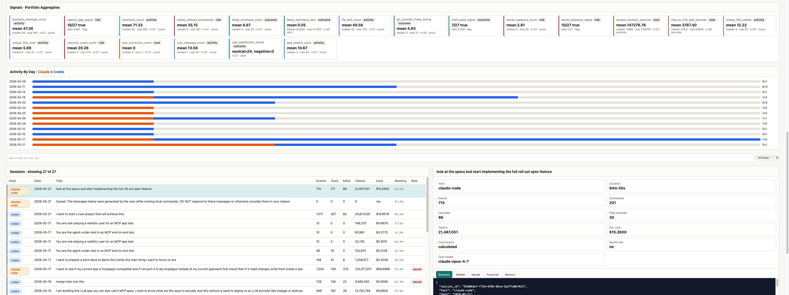

# retro


Capture **Codex**, **Claude Code**, and **VS Code GitHub Copilot Chat** rollouts into durable local artifacts, evaluate them with signals, mine them into prompt-time memory, and report on cost and behavior via a static dashboard. Local-first, no cloud, evidence-linked.

Project wiki and onboarding guides: <https://sajjadgg.github.io/retro/>

This project answers two questions that "another memory store" doesn't:

1. **How did this rollout actually go?** (signals: activity, outcome, cost, risk)
2. **What can the next session reuse from it?** (mining: skills, procedures, failure triggers)

The full design is split across specs in [`specs/`](specs/). The headline ones:

- [`full_rollout_capture_feature_spec.md`](specs/full_rollout_capture_feature_spec.md) — the capture contract.
- [`rollout_signals_spec.md`](specs/rollout_signals_spec.md) — what signals are and how they aggregate.
- [`rollout_mining_methods.md`](specs/rollout_mining_methods.md) — the catalog of mining methods.
- [`memory_storage_backend_spec.md`](specs/memory_storage_backend_spec.md) — SQLite memory index over flat files.
- [`rollout_dashboard_spec.md`](specs/rollout_dashboard_spec.md) — the dashboard.
- [`ccusage_comparison_spec.md`](specs/ccusage_comparison_spec.md) — gap analysis vs. ccusage.
- [`global_rollout_archive_migration_plan.md`](specs/global_rollout_archive_migration_plan.md) — global archive, migration, and periodic sync design.
- [`CHANGELOG.md`](CHANGELOG.md) — release history and upgrade notes.

---

## Table of contents

- [Install](#install)
- [Global setup and periodic capture](#global-setup-and-periodic-capture)
- [Architecture at a glance](#architecture-at-a-glance)
- [Storage layout](#storage-layout)
- [Capture](#capture)
- [Signals](#signals)
- [Mining](#mining)
- [Time-consistent benchmarks](#time-consistent-benchmarks)
- [Memory backend](#memory-backend)
- [Dashboard](#dashboard)
- [Pricing snapshot](#pricing-snapshot)
- [Release and publishing](#release-and-publishing)
- [Environment](#environment)
- [Notes and guarantees](#notes-and-guarantees)

---

## Install

Requires Python ≥ 3.9.

From PyPI:

```bash
python3 -m pip install --upgrade retro-ai
retro --help
```

The distribution is named `retro-ai`; it installs the `retro` command through
the package's console entry point. Inside a virtual environment, the command is
added to that environment's `bin/` directory. For a persistent command managed
outside a project environment, use:

```bash
python3 -m pip install --user --upgrade retro-ai
```

If pip warns that its scripts directory is not on `PATH`, add the directory
shown in that warning to your shell configuration. On macOS with the system
Python 3.9, that is commonly:

```bash
export PATH="$HOME/Library/Python/3.9/bin:$PATH"
```

Then reopen the terminal and run `retro --help`.

From a clone:

```bash
python3 -m venv .venv
.venv/bin/pip install -e .
```

The PyPI distribution is named `retro-ai` because the `retro` project name is
already occupied on PyPI; the Python import package and CLI command are both
named `retro`.

---

## Global setup and periodic capture

Retro uses one archive for the current OS user, regardless of the directory
where `retro` is invoked. Configure it and install the macOS user LaunchAgent
explicitly:

```bash
retro setup \
  --archive-root "$HOME/Library/Application Support/retro/rollout-memory" \
  --dashboard-dir /Users/sajad/Dev/repos/Mem/dashboard \
  --periodic 15m \
  --derived-every 6h
```

`pip install` never installs a background job by itself. `retro setup` writes
the user config and installs the job. Use a stable `pipx` or per-user runtime;
the scheduler refuses project/worktree `.venv` executables that may disappear.

```bash
retro config show
retro doctor
retro sync
retro schedule status
retro schedule run-now
retro schedule uninstall
```

Root precedence is `--root`, `RETRO_ROOT`, the legacy
`RETRO_ARTIFACT_ROOT`, user config, then the platform per-user data directory.
On macOS, operational state is under `~/Library/Application Support/retro/`
and logs are under `~/Library/Logs/retro/`.

`retro sync` imports only new or changed local source sessions, preserves a raw
revision when an upstream source was rewritten rather than appended, updates
signals for changed sessions, and atomically switches the dashboard generation.
It uses a cross-process archive lock, warns below 5 GiB free, and refuses a
scheduled run below 2 GiB. Scheduled capture runs every 15 minutes; expensive
signal and dashboard work is coalesced and runs at most every 6 hours by
default. Manual `retro sync` refreshes pending derived work immediately.

### Archive migration

Migrations are checksummed, resumable, and refuse conflicting overwrites:

```bash
retro archive plan \
  --from /path/to/old-a/rollout-memory \
  --from /path/to/old-b/rollout-memory \
  --into "$HOME/Library/Application Support/retro/rollout-memory"

retro archive migrate --plan /path/to/plan.json --rebuild-derived
retro archive verify --plan /path/to/plan.json
retro archive cutover --plan /path/to/plan.json --link-path /path/to/legacy/rollout-memory
```

Cutover is allowed only after a successful derived rebuild and a newer
verification. The original legacy archive is moved to a retained source-backup
directory before its old path becomes a compatibility symlink.

---

## Architecture at a glance

```
                  ┌──────────────────────────────────────────────────────────┐
                  │                       retro CLI                       │
                  ├──────────────┬─────────────┬──────────────┬───────────┤
   ~/.claude  ──▶ │  importers   │   signals   │    mining    │  memory   │
   ~/.codex   ──▶ │  (claude,    │  (heuristic │  (4 methods, │  index    │
 VS Code User ──▶ │ codex,       │  + external)│  + filters)  │  + weave  │
                  │ copilot)     │             │              │           │
                  └──────┬───────┴──────┬──────┴───────┬──────┴─────┬─────┘
                         ▼              ▼              ▼            ▼
                       raw/        normalized/      mined/      memories/
                  (immutable)    (events.jsonl)   (per method) (files + SQLite)
                         │
                         ▼
                     rendered/   ← markdown view (any time)
                         │
                         ▼
                    retro dashboard build
                  (static HTML + KPIs + per-model cost + signals + drill-down)
```

Each stage is independent — you can re-render markdown, recompute signals, re-mine, rebuild the memory index, or rebuild the dashboard from whatever `rollout-memory/` already has on disk.

---

## Storage layout

Artifacts land in the configured per-user archive. The platform default on
macOS is `~/Library/Application Support/retro/rollout-memory`:

```
rollout-memory/
  raw/<host>/<session-id>/                   # immutable copies of source jsonl + metadata + sidecars
    transcript.jsonl        (claude)
    rollout.jsonl           (codex)
    session.jsonl|json       (vscode-copilot) # verbatim VS Code chat persistence
    session.snapshot.json    (vscode-copilot) # reconstructed JSONL mutation state
    transcript.jsonl         (vscode-copilot) # direct Copilot event log, when available
    events.jsonl             (vscode-copilot) # Copilot CLI / Agent Host rollout
    import_meta.json        (claude)         # source path, project_slug, claude_home, …
    import_meta.json        (vscode-copilot) # workspace, models, sources, capture fingerprint
    thread.json             (codex)          # cwd, model_provider, source_kind, spawn_edges, …
    sidecars/               # Claude todos/tasks or Copilot edits/resources/session-store rows

  normalized/<host>/<session-id>.events.jsonl  # one normalized event per line

  rendered/<host>/<session-id>.md             # human-readable markdown view

  mined/<method>/<host>/<session-id>.json     # mined candidates (structured)
  mined/<method>/<host>/<session-id>.prompt.md  # paste-ready prompt block

  signals/
    readings.jsonl                            # one row per (session, signal)
    aggregates.json                           # rolled-up stats per signal
    summary.md                                # human view

  memories/
    items.jsonl                               # canonical appended memory records
    events.jsonl                              # memory lifecycle / utility log
    index.sqlite                              # derived SQLite + FTS index, rebuildable

  benchmarks/<benchmark-id>/                  # immutable generated task version
    manifest.json                             # cutoff, snapshot, method, checksums
    tasks/prompts/<level>.jsonl                # isolated learner input for one prompt level
    private/ground-truth.jsonl                # evaluator-only truth + provenance
    private/historical-localization-predictions.jsonl
    knowledge/eligible-event-refs.jsonl        # pre-cutoff evidence boundary

  benchmark-runs/<benchmark-id>/<run-id>/      # immutable evaluation result
    run-manifest.json
    predictions.jsonl
    results.json
    report.md
    private/task-details.jsonl
    private/runner/                            # optional GhostLab traces and policy
```

`raw/` is treated as **immutable**: re-importing the same session refuses unless `--force` is passed.

---

## Capture

Discovery merges each host's default roots and honors comma-separated overrides.

| Host | Default roots | Env override |
| --- | --- | --- |
| Claude Code | `~/.claude/projects/` and `~/.config/claude/projects/` | `CLAUDE_CONFIG_DIR` |
| Codex | `~/.codex` (uses `state_5.sqlite.threads.rollout_path`) | `CODEX_HOME` |
| VS Code Copilot | Platform VS Code/Insiders `User` directories, `~/.vscode-server*/data/User`, and `~/.copilot/session-state` | `VSCODE_COPILOT_USER_DIRS`, `COPILOT_HOME`, `COPILOT_SESSION_STATE_DIRS` |

Codex roots are auto-classified:
- **sqlite_home**: has `state_5.sqlite` → discovery via SQLite (preserves spawn-edge graph).
- **sessions_dir**: has a `sessions/` subdir but no SQLite → scan `*.jsonl`.
- **jsonl_dir**: neither → treat the directory as a flat JSONL bag (e.g. `codex exec --json` output).

### Commands

```bash
# Discover what's available on this machine
retro list                           # all hosts, with retention warning for old Claude logs
retro list --host claude
retro list --host codex
retro list --host copilot
retro list --limit 50

# Import a single session
retro import claude --session-id <session-id>
retro import codex  --thread-id  <thread-id>
retro import copilot --session-id <session-id>
retro import claude --latest         # most-recent
retro import codex  --latest
retro import copilot --latest

# Import every discoverable session
retro import all                     # all supported hosts
retro import claude --all
retro import codex  --all
retro import copilot --all
retro import all --limit-per-host 20

# Force overwrite an existing capture
retro import claude --latest --force

# Skip the markdown re-render step
retro import codex --latest --no-render

# Re-render markdown from an already-imported normalized stream
retro render claude <session-id>
retro render codex  <thread-id>
retro render copilot <session-id>

# Inspect what got captured
retro show claude <session-id>
retro show codex  <thread-id>
retro show copilot <session-id>
```

### Multi-root example

```bash
# Pull in Claude logs from two locations:
CLAUDE_CONFIG_DIR="$HOME/.claude,$HOME/.config/claude,/backup/claude-archive" retro import claude --all

# Codex saved via `codex exec --json` (no SQLite present):
CODEX_HOME="$HOME/.codex,$HOME/codex-exec-logs" retro import codex --all

# VS Code profiles or remote User roots outside the platform defaults:
VSCODE_COPILOT_USER_DIRS="$HOME/custom-code/User,$HOME/.vscode-server/data/User" retro import copilot --all

# Copilot CLI / Agent Host state outside ~/.copilot/session-state:
COPILOT_SESSION_STATE_DIRS="/archive/copilot/session-state" retro import copilot --all
```

### Capture coverage and retention

When the oldest discoverable Claude transcript is **more than 25 days old**, `retro list` prints a yellow warning. Claude Code retains logs for ~30 days by default — capture older sessions before they age out, or raise `cleanupPeriodDays` in Claude settings.

VS Code Copilot discovery reads both legacy full-session `.json` files and current append-only `.jsonl` mutation logs under `workspaceStorage/*/chatSessions/`. When present, it also captures Copilot's direct event transcript, editing-session snapshots, tool-result resources, workspace metadata, and the matching rows from `github.copilot-chat/session-store.db`. Empty and non-Copilot chat sessions are excluded.

Copilot CLI and VS Code Agent Host sessions are captured from `~/.copilot/session-state/<session-id>/events.jsonl`, including active sessions. The matching rows from `~/.copilot/session-store.db` provide titles, workspace metadata, model usage, cache/reasoning tokens, and Copilot request units. Active sessions are point-in-time snapshots; rerun `retro import copilot --all` after more activity to append the newer source state.

`retro` can only archive rollout content that exists on the local machine. Account or cloud sessions that have never been downloaded, or whose local event logs were already removed, cannot be reconstructed from VS Code's small telemetry/index entries alone.

---

## Signals

Signals are evaluators that observe a captured rollout and emit a comparable reading (numeric / boolean / categorical). They answer: *"how did this rollout go, by some objective measure?"*

Signals are grouped by intent, not implementation:

| Group      | Question answered                       | Examples |
| ---------- | --------------------------------------- | -------- |
| `activity` | What did the agent do?                  | `command_count`, `unique_files_edited`, `web_search_count` |
| `outcome`  | Did the work land?                      | `git_commits_made_during`, `failed_command_ratio`, `user_satisfaction_lexical` |
| `cost`     | What did it cost (effort/tokens/time)?  | `session_duration_seconds`, `user_correction_count`, `time_to_first_edit_seconds` |
| `risk`     | How trustworthy was the capture/work?   | `unknown_event_count`, `capture_gap_signal`, `secret_exposure_signal` |

Methods: `heuristic` (pure event walk), `regex` (text patterns), `external` (touches the world — e.g. `git log`). `llm_judge` is reserved for later.

### Commands

```bash
# Inventory of registered signals
retro signal list
retro signal list --group outcome

# Compute signals for every imported session
retro signal run

# Restrict scope
retro signal run --host claude
retro signal run --host codex --session-id <id>
retro signal run --signal git_commits_made_during,failed_command_ratio

# Inspect readings for one session
retro signal show claude <session-id>
retro signal show codex  <thread-id>
```

### Output

- `rollout-memory/signals/readings.jsonl` — one row per `(session, signal)` reading.
- `rollout-memory/signals/aggregates.json` — per-signal cross-session aggregates (mean / median / p90 / sum / histogram).
- `rollout-memory/signals/summary.md` — human view.

Each reading carries `evidence_refs` (event_ids), `confidence`, and a `method` tag so it can be traced back to the rollout. External signals (e.g. `git_commits_made_during`) emit a `null` reading with a `reason` field when their context is missing (cwd gone, not a git repo) rather than silently skipping.

### Adding a new signal

```python
from retro.signals.base import SessionContext, reading, register

@register("my_signal", group="outcome", kind="boolean",
          method="heuristic", description="…")
def _my_signal(ctx: SessionContext):
    return reading(ctx, _my_signal, value=True, evidence=[some_event])
```

`retro signal list`/`run`/`show` and the dashboard pick it up automatically.

---

## Mining

Mining turns captured rollouts into **prompt-time memory candidates** — paste-ready blocks for the next session. Multiple methods are registered; each produces the same `MemoryCandidate` shape so they compose. Filters run after methods to prune unsafe / redundant candidates.

### Registered methods

| Method            | What it produces                                                                              | Source paper |
| ----------------- | --------------------------------------------------------------------------------------------- | ------------ |
| `reme_refine_poc` | Success patterns, failure triggers, tool lessons, risk rules.                                 | [ReMe](https://arxiv.org/abs/2512.10696) |
| `skill_pro`       | Reusable skills with explicit `activation` / `steps` / `termination` / `verification` blocks. | [Skill-Pro](https://arxiv.org/abs/2602.01869) |
| `memp_procedural` | Whole-session procedural memory: `goal` / `preconditions` / `steps` / `warnings` / `outcome`. | [Memp](https://arxiv.org/abs/2508.06433) |
| `codex_headless`  | LLM-backed extraction through `codex exec --json`; saves the headless Codex JSONL capture.     | local Codex CLI |

### Registered filters

| Filter       | What it does                                                                              |
| ------------ | ----------------------------------------------------------------------------------------- |
| `risk_aware` | Drops `risk=high` and low-confidence candidates, dedupes near-duplicates, caps at 8 items. |

The default methods are **deterministic and local**. `codex_headless` is opt-in and calls `codex exec --json` on a compact, redacted rollout summary. It writes the Codex headless stream to `rollout-memory/headless/codex_headless/<host>/<session-id>.codex.jsonl`.

### Commands

```bash
# Inventory
retro methods

# Single method, single session (default method is reme_refine_poc)
retro mine codex <thread-id>
retro mine claude <session-id> --method skill_pro
retro mine codex  <thread-id>  --method memp_procedural
retro mine codex  <thread-id>  --method codex_headless

# Run every registered method on one session
retro mine codex <thread-id> --method all

# Apply one or more filters after mining
retro mine codex <thread-id> --method skill_pro --filter risk_aware
retro mine codex <thread-id> --method all       --filter risk_aware

# Bulk mine
retro mine '*' '*' --method all --filter risk_aware
retro mine codex  '*' --method skill_pro
retro mine claude '*' --method memp_procedural --all
```

### Output

For each `(method, host, session_id)`:

- `rollout-memory/mined/<method>/<host>/<id>.json` — full structured result (candidates, structured payloads, evidence refs, notes, filters applied).
- `rollout-memory/mined/<method>/<host>/<id>.prompt.md` — paste-ready memory block tagged with `<retro method="…">`, sorted by priority and confidence.

### Example skill_pro output

```text
Skill: investigate and patch a bug
  Activation: gi ahead and fix the issues found here
  Steps:
    1. TaskCreate (Scan both ~/.claude/projects/ and ~/.config/claude/projects/…)
    2. read file (file_path=~/…/retro/importers/claude.py)
    3. edit file (file_path=~/…/retro/importers/claude.py)
    …
  Termination: after writing ~/…/Mem/specs/ccusage_comparison_spec.md
  Verification: (no explicit verification observed)
```

### Adding a new method

```python
# src/retro/mining/methods/my_method.py
from ..base import MiningContext, MiningResult, MemoryCandidate, register_method, memory_id

@register_method("my_method", description="…")
def mine_my_method(ctx: MiningContext) -> MiningResult:
    candidates = [
        MemoryCandidate(
            id=memory_id(ctx.session_id, "my_method", 1),
            method="my_method",
            kind="procedure",
            text="…",
            when_to_use="…",
            evidence_refs=[ev.event_id for ev in ctx.events[:3]],
            confidence=0.6,
            priority=4,
        )
    ]
    return MiningResult(
        session_id=ctx.session_id, host=ctx.host, method="my_method",
        task_summary=ctx.task_summary(), candidates=candidates,
    )
```

Import it in `mining/methods/__init__.py`. `retro methods` and `--method` pick it up.

---

## Time-consistent benchmarks

`retro benchmark` implements the construction and evaluation protocol from
[A Time-Consistent Benchmark for Repository-Level Software Engineering
Evaluation](https://arxiv.org/abs/2603.26137), adapted to private rollout data.
The paper creates tasks from pull requests merged after a cutoff. Retro uses a
post-cutoff user goal episode as the task and the episode's file-edit events as
hidden modified-file ground truth.

The core validity boundary is unchanged:

- repository snapshot and augmentation knowledge are fixed at or before `T0`;
- tasks come only from `(T0, T1]`;
- generated prompts never expose the hidden changed-file names;
- baseline and augmented predictions are compared only when task, model, prompt
  level, snapshot, and metric match.

The paper defines but does not publish exact templates for its four prompt
levels. Retro therefore uses a deterministic, local, leakage-filtered
reconstruction:

| Level | Retro contract |
|---|---|
| `minimal` | High-level action sentence only |
| `concise` | Minimal task plus affected component |
| `contextual` | Problem/use context and component, without inline implementation details; default |
| `guided` | Richer source context plus change-shape and validation guidance |

Each level is written to a separate task file. A minimal-prompt run therefore
cannot read the contextual or guided variant, post-cutoff event references,
expected file count, or modified-file truth.

### Build and evaluate

Both `--cutoff` and `--end` must be timezone-aware. Benchmark versions and run
IDs are immutable; choose a new ID rather than overwriting an earlier result.

```bash
# Build tasks from all matching captured hosts for one local repository.
retro benchmark build cortex-20260601-v1 \
  --project /path/to/repository \
  --cutoff 2026-06-01T00:00:00Z \
  --end 2026-08-01T00:00:00Z \
  --host '*'

# Inventory benchmark versions.
retro benchmark list

# Score a model or agent run.
retro benchmark evaluate cortex-20260601-v1 predictions.jsonl \
  --run-id baseline-contextual-v1

# Score the generated diagnostic derived from the captured agent's pre-edit
# inspection events. This is not a generated-prompt baseline.
retro benchmark evaluate cortex-20260601-v1 \
  "/path/to/rollout-memory/benchmarks/cortex-20260601-v1/private/historical-localization-predictions.jsonl" \
  --run-id historical-observed-v1
```

Each prediction JSONL row has this contract:

```json
{"task_id":"tcl_...","condition":"baseline","model":"model-id","prompt_level":"contextual","predicted_files":["src/example.py","tests/test_example.py"]}
```

Use repository-relative paths. By default, every
`(condition, model, prompt_level)` group must predict all tasks. Pass
`--allow-partial` only for explicitly diagnostic runs. If both `baseline` and
`augmented` groups are present, Retro reports the matched per-task mean F1
delta and win/tie/loss counts.

Task metrics are exact file-set precision, recall, and F1. The paper's score is
the unweighted mean task-level F1; Retro also reports micro metrics, exact-match
rate, zero-precision rate, perfect-recall rate, and zero-recall rate. This is a
localization benchmark, not evidence that a patch is correct or that tests pass.

### Run tasks safely with GhostLab and OpenShell

The optional sandbox runner requires Python 3.10 or newer, GhostLab, and a
connected NVIDIA OpenShell gateway:

```bash
python3.11 -m venv .venv
.venv/bin/pip install -e ".[sandbox]"
openshell status
```

Run one fresh OpenShell sandbox per benchmark task:

```bash
export COPILOT_GITHUB_TOKEN=...

retro benchmark run cortex-20260601-v1 \
  --model mai-code-1.1-flash \
  --prompt-level contextual \
  --run-id mai-ghostlab-contextual-v1 \
  --workers 2
```

If a Copilot-capable GitHub token is already stored by Git's credential helper,
`--use-git-credential` explicitly requests it without writing the value to an
artifact. Environment variables are otherwise never inherited implicitly.

The runner:

- materializes the pinned commit using `git archive`, so the sandbox receives no
  `.git` history, dirty working tree, hidden verifier, or benchmark files;
- marks the uploaded snapshot read-only and disables Copilot shell, write, URL,
  memory, custom-instruction, remote-control, and built-in MCP capabilities;
- uses a provider-only OpenShell egress policy and forwards only the selected
  credential variable;
- creates and destroys an independent sandbox for every task;
- rejects unexpected tools, model errors, malformed predictions, and incomplete
  task sets rather than producing success-shaped output;
- stores raw task traces and OpenShell logs under the run's mode-`0700`
  `private/runner/` directory and checksums them in the immutable run manifest.

`--use-git-credential` is opt-in because it grants the isolated model process
access to the retrieved token for the duration of the run. The value is removed
from Retro's process environment afterward and never included in run metadata.

---

## Memory backend

The memory backend turns mined and authored memories into a local SQLite index. Flat files remain the source of truth; `index.sqlite` is a derived cache that can be deleted and rebuilt.

The index currently supports:

- SQLite schema bootstrap with FTS5 keyword recall.
- Reindexing from `rollout-memory/memories/items.jsonl` and existing mined artifacts.
- `[[wiki-link]]` edge extraction and one-hop linked-memory expansion.
- Authored markdown import with simple frontmatter.
- Keyword retrieval with scope/repo filtering and value-aware reranking.
- Utility updates through `memories/events.jsonl`.
- Prompt-time context weaving.
- Dashboard counts for indexed memory, status/scope/kind, top utility, and lifecycle events.

### Commands

```bash
# Create rollout-memory/memories/ and an empty index
retro memory init

# Rebuild index.sqlite from files and mined artifacts
retro memory reindex

# Inspect index counts and dangling wiki-links
retro memory doctor

# Import hand-authored markdown memories
retro memory import-authored ~/path/to/memory-notes

# Retrieve ranked memories; include candidates by default while promotion matures
retro memory retrieve --query "pytest retrieval" --cwd /path/to/repo
retro memory retrieve --query "pytest retrieval" --cwd /path/to/repo --accepted-only

# Emit a compact prompt block
retro memory weave --query "pytest retrieval" --cwd /path/to/repo

# Update observed utility after a memory is used
retro memory update-utility --memory-id <id> --reward 0.8 --session-id <session-id>
```

### Authored markdown

Authored memories are normal markdown files. Frontmatter is optional; missing fields get conservative defaults.

```markdown
---
id: pytest-policy
kind: tool_lesson
scope: global
status: accepted
risk: low
when_to_use: Use when editing tests.
---
Run pytest after changing retrieval. Link to [[debugging-policy]] when relevant.
```

Accepted memories that contain prompt-injection markers, credential-looking strings, or invisible control characters are downgraded to `needs_review` on write.

Optional embeddings are still intentionally out of the core path for now; keyword retrieval works with no native dependencies.

---

## Dashboard

A static, local HTML dashboard reads everything under `rollout-memory/` and produces:

- KPI strip (sessions, days, events, tool calls, tokens, est. cost).
- Signals panel (color-coded by group, per-signal aggregates across sessions).
- Activity-by-day bars.
- Searchable / filterable session table.
- Per-session drill-down with tabs: **Summary**, **Models**, **Signals**, **Transcript**, **Memory**.
- Indexed memory sections for counts, top utility, lifecycle events, and source-session drill-downs when `retro memory reindex` has been run.

The **Models** tab shows the per-model token + cost breakdown (input / cache_create / cache_read / output / total / cost) for each session.

### Preview




### Build

```bash
# Default mode: auto (use embedded cost when present, else compute from tokens)
retro dashboard build

# Force recomputation from token counts
retro dashboard build --mode calculate

# Show only provider-embedded costUSD; None when missing
retro dashboard build --mode display

# Build from a non-default artifact root / to a non-default output directory
retro dashboard build --root /path/to/rollout-memory --out /path/to/output

# Module form (the builder ships inside the package; works from any install)
RETRO_COST_MODE=calculate python -m retro.dashboard_build
python -m retro.dashboard_build --artifact-root /path/to/rollout-memory

# Experimental: trajectory-signals page (trajectory_experiments.html)
retro dashboard experiments
```

The artifact root and dashboard output come from the per-user config. Override
either for one command with `--root` and `--out`.

Then open the configured `dashboard/index.html` directly from disk.

### Cost computation

- **LiteLLM pricing snapshot** bundled at `src/retro/pricing/litellm-pricing.json` is the authoritative source for per-model rates (USD per token). The hardcoded `DEFAULT_RATES` table is the fallback for any model not in the snapshot.
- **Per-model attribution**: each token delta is tagged with the active model (`turn_context.model` for Codex, per-message `model` for Claude). Multi-model sessions produce per-model rows.
- **Copilot usage**: VS Code request snapshots provide prompt/completion totals; Copilot CLI and Agent Host sessions add per-model input, output, cache read/write, reasoning tokens, and Copilot request units from the local session database.
- **Codex token deltas** prefer the explicit `info.last_token_usage` per-turn delta when present, falling back to cumulative subtraction for older Codex builds.
- **Cached-input handling** follows each source format: Codex totals include cached input; Copilot Agent Host totals are split into fresh input, cache reads, and cache writes during normalization; Anthropic input is already non-cached.
- **Cost source labeling**: each session records whether its cost was `embedded` (provider-supplied) or `calculated` (token math).

Numbers are always estimates, never billing truth.

---

## Pricing snapshot

The dashboard pulls rates from the bundled `src/retro/pricing/litellm-pricing.json` — a curated subset of [LiteLLM's `model_prices_and_context_window.json`](https://github.com/BerriAI/litellm). Refresh it with:

```bash
python dashboard/pricing/refresh.py
```

The refresh script:

1. Reads the existing snapshot's model list (top-level keys).
2. Downloads LiteLLM's upstream JSON.
3. Replaces pricing fields for known models from upstream; leaves the local set otherwise.
4. Updates `_meta.snapshot_taken`.

To add a model: add an empty entry under its name in the snapshot, then re-run `refresh.py`.

---

## Release and publishing

CI lives in `.github/workflows/ci.yml`. It runs on pushes and pull requests to `main`, installs the package across Python 3.9-3.13, compiles `src/retro`, smoke-tests the CLI, builds the wheel/sdist, and validates them with `twine check`.

Publishing lives in `.github/workflows/publish.yml`. It runs when a GitHub release is published, builds the package, publishes it to PyPI with trusted publishing, and attaches the wheel/sdist to the GitHub release.

One-time PyPI setup:

1. Create or claim the PyPI project `retro-ai`.
2. Add a trusted publisher for repository `sajjadGG/retro`.
3. Use workflow `.github/workflows/publish.yml`.
4. Use environment `pypi`.

Release flow:

```bash
# bump version in pyproject.toml first
git tag v0.3.0
git push origin v0.3.0
```

Then publish a GitHub release for that tag. The release event triggers the PyPI publish job.

---

## Environment

| Variable             | Effect                                                                                                  |
| -------------------- | ------------------------------------------------------------------------------------------------------- |
| `CLAUDE_CONFIG_DIR`  | Override Claude data roots (comma-separated). Wins over the default `~/.claude` + `~/.config/claude`.   |
| `CODEX_HOME`         | Override Codex roots (comma-separated). Each root is classified into `sqlite_home`/`sessions_dir`/`jsonl_dir`. |
| `RETRO_COST_MODE`     | Default `--mode` for the dashboard builder. One of `auto`, `calculate`, `display`.                       |
| `RETRO_ARTIFACT_ROOT` | Default `--artifact-root` for the dashboard builder (the `rollout-memory/` directory to read).          |

---

## Notes and guarantees

- **Local-only.** Nothing is uploaded.
- **Raw is immutable.** Re-imports refuse to clobber `raw/` unless `--force` is passed.
- **Capture gaps are reported, not hidden.** Unknown event types become `unknown` normalized events with the original payload preserved; counts surface in `retro show`, the `unknown_event_count` signal, and the dashboard.
- **Everything is evidence-linked.** Signal readings and mined memories carry the `event_id`s they were derived from, so the dashboard can trace any claim back to the source rollout.
- **Composable.** Capture, signals, mining, and the dashboard each consume the layer below from disk. Re-run any stage independently.
- **Designed beyond ccusage on purpose.** ccusage reports tokens and costs. This project captures the whole rollout, evaluates it with signals, and turns it into reusable behavioral memory. See [`specs/ccusage_comparison_spec.md`](specs/ccusage_comparison_spec.md) for the full comparison.

## Project layout

```
src/retro/
  schema.py              # NormalizedEvent + read/write helpers
  storage.py             # artifact layout
  cli.py                 # Typer CLI (`retro`)
  renderer.py            # Markdown view
  analyzer.py            # command/tool pattern analysis + operator diagnostics
  memory_store.py        # SQLite memory index (FTS5, wiki-links, weave)
  llm.py                 # headless `codex exec` helper
  quest.py               # daily quests / streak progression (experimental)
  trajectory.py          # trajectory extraction for experimental signals
  dashboard_build.py     # static HTML + rollouts.json builder (`retro dashboard build`)
  dashboard_experiments.py  # trajectory-signals page (experimental)
  dashboard_terminal.py  # interactive terminal dashboard (`retro dashboard view`)
  pricing/
    litellm-pricing.json # bundled LiteLLM rates snapshot
  importers/
    base.py              # ImportResult
    claude.py            # Claude Code transcript reader (multi-root + env override)
    codex.py             # Codex SQLite + JSONL reader (multi-root)
  signals/
    base.py, runner.py, heuristics.py, external.py
    trajectory.py        # experimental trajectory signals
  mining/
    base.py              # MemoryCandidate, MiningResult, registries
    render.py            # prompt-block markdown rendering + write helpers
    methods/
      reme_refine.py     # success patterns + failure triggers + risk rules
      skill_pro.py       # reusable skill blocks
      memp_procedural.py # whole-session procedural memory
      codex_headless.py  # LLM-backed extraction via `codex exec --json`
    filters/
      risk_aware.py      # prune high-risk / low-confidence / near-duplicates

dashboard/
  build_dashboard.py     # back-compat shim → retro.dashboard_build
  pricing/refresh.py     # refresh the bundled snapshot from upstream LiteLLM
  README.md
  index.html             # generated
  data/rollouts.json     # generated

specs/                    # design docs (see top of this README)
rollout-memory/          # captured artifacts (gitignored)
```
