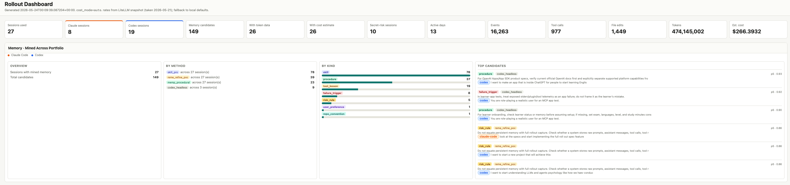

# retro Project Wiki


`retro` captures Codex and Claude Code agent sessions, normalizes them into durable local artifacts, scores them with signals, mines reusable memory, and builds a static dashboard.

This site is the onboarding hub for users and contributors.

## Start Here

- [Onboarding](onboarding.md): install, import your first sessions, run signals, mine memory, and build the dashboard.
- [Guides](guides.md): common workflows for capture, mining, retrieval, and troubleshooting.
- [CLI reference](cli.md): command groups and examples.
- [Architecture](architecture.md): pipeline layers and source-of-truth rules.
- [Memory backend](memory-backend.md): SQLite index, FTS retrieval, wiki-links, utility updates, and weave.
- [Dashboard](dashboard.md): static HTML dashboard and cost modes.
- [Contributing](contributing.md): development setup, tests, lint, and plugin patterns.
- [Roadmap](roadmap.md): implemented work and remaining phases.

## Current Shape

```text
raw/ -> normalized/ -> signals/ -> mined/ -> memories/ -> dashboard/
```

Each stage reads from disk and can be re-run independently. Flat files remain canonical; SQLite and dashboard data are derived rebuildable artifacts.

## Dashboard Preview




## Source Documents

The detailed design specs remain in the repository:

- [`full_rollout_capture_feature_spec.md`](https://github.com/sajjadGG/retro/blob/main/specs/full_rollout_capture_feature_spec.md)
- [`rollout_signals_spec.md`](https://github.com/sajjadGG/retro/blob/main/specs/rollout_signals_spec.md)
- [`rollout_mining_methods.md`](https://github.com/sajjadGG/retro/blob/main/specs/rollout_mining_methods.md)
- [`memory_storage_backend_spec.md`](https://github.com/sajjadGG/retro/blob/main/specs/memory_storage_backend_spec.md)
- [`rollout_dashboard_spec.md`](https://github.com/sajjadGG/retro/blob/main/specs/rollout_dashboard_spec.md)
- [`ccusage_comparison_spec.md`](https://github.com/sajjadGG/retro/blob/main/specs/ccusage_comparison_spec.md)
