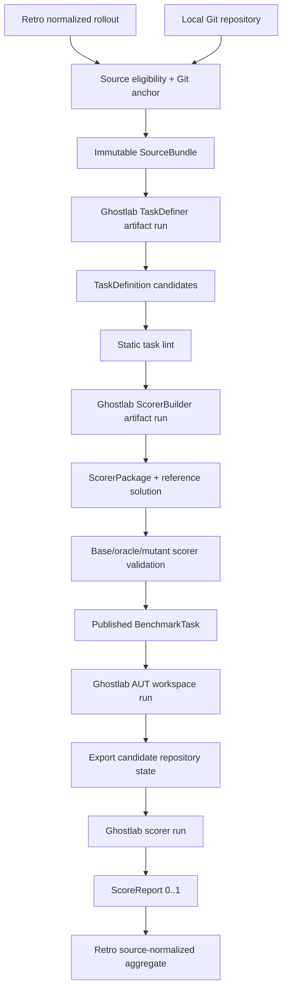

# Rollout-to-Task-and-Scorer Pipeline

Status: implementation specification v1

Date: 2026-08-29

Owners:

- Retro owns rollout selection, Git-state provenance, benchmark artifacts, and aggregation.
- Ghostlab owns sandboxed agent execution and scorer execution.

## 1. Exact product

Given a Retro rollout associated with a Git repository, build one or more runnable benchmark cases:

```text
(rollout, initial Git state, accepted outcome)
    -> TaskDefinition
    -> ScorerPackage
    -> validated BenchmarkTask
```

A `BenchmarkTask` has exactly three inputs at evaluation time:

1. a repository materialized at one immutable base commit;
2. one user message containing the task;
3. one hidden scorer package.

Any configured coding agent can be run on that repository and message. The scorer consumes the resulting repository state and returns a number in `[0, 1]` plus component evidence. A benchmark run aggregates those numbers across tasks.

This spec does not attempt to model the user's complete task distribution. It implements the narrower object requested here: turn selected Git-backed rollouts into executable, scored tasks.

## 2. Locked v1 decisions

These are implementation decisions, not open design themes.

1. **Git repositories only.** The source rollout must resolve to a local Git root.
2. **Clean commit base only.** `base_sha^{tree}` must equal the captured start tree. Dirty-worktree replay is rejected in v1.
3. **Single-message task.** The evaluated agent receives no user emulator and no later clarification turns.
4. **Resolved user request.** The task prompt may combine user-authored requirements from the rollout into one message, but may not include solution facts learned only from agent actions or the accepted diff.
5. **Zero tasks is valid.** A rollout with no stable, replayable, scorable goal produces a rejection record, not a weak task.
6. **At most three replay tasks per rollout.** Separate tasks require separable outcome evidence. Otherwise produce one combined task or reject.
7. **Adjacent tasks are opt-in.** `--adjacent-per-replay 0` is the default; the maximum is one adjacent task per accepted replay task.
8. **Deterministic scoring first.** Code or state checks are required whenever the claimed outcome is executable. An LLM judge may score only residual criteria.
9. **Behavior, not patch similarity.** The accepted diff is oracle evidence and may be used to construct tests. Exact diff, file overlap, and textual similarity cannot contribute to `score_total`.
10. **Scorer errors are not agent failures.** A scorer crash yields `scorer_error` and no numeric task result.
11. **Source-normalized aggregation.** Each rollout has equal default aggregate weight regardless of how many tasks were extracted from it.
12. **Content-addressed and resumable.** Every source bundle, task, scorer, agent config, and run is hashed. Re-running an unchanged stage reuses its artifact.

## 3. Current repository facts and required gaps

The design is based on Retro commit `bc4a06d4f58fd8874828f33610417ec372dc0454` and Ghostlab commit `096bf3aab21ac9bd441aa249f03f5d41cd626603`.

### 3.1 Retro already provides

- `NormalizedEvent` JSONL with stable `event_id`, sequence, timestamp, actor, type, raw reference, and payload in `src/retro/schema.py`.
- Raw Codex rollout plus `thread.json`, whose metadata includes `cwd`, `created_at`, `updated_at`, `git_branch`, and source rollout path.
- Raw Claude transcript whose native events contain `cwd`.
- A `Layout` abstraction for derived artifacts.
- `src/retro/benchmarks/time_consistent.py`, which extracts post-cutoff user-goal
  episodes with successful file edits, emits three leakage-checked prompt levels,
  retains event provenance and rejection counts, publishes checksum-verified
  immutable artifacts, and evaluates hidden file-localization truth.
- `src/retro/benchmarks/ghostlab_runner.py`, which materializes a pinned commit
  without `.git`, runs each localization task in an independent Ghostlab
  OpenShell sandbox, restricts tools and network egress, fingerprints the run,
  and persists private diagnostics.

### 3.2 Retro does not yet provide

- the exact `HEAD` and dirty-worktree state at each session start and end;
- proof that the start worktree was clean;
- an immutable base repository bundle;
- an outcome commit selected from the rollout;
- a rollout-to-Git event graph;
- implementation-task, scorer-package, or numeric score-report schemas;
- a mutating agent-under-test run whose resulting repository is exported;
- correctness scoring beyond the existing file-localization F1 metric.

The first two cannot be reconstructed reliably from a later timestamp alone. Future imports must capture them at session start/end. Historical sessions without an exact base SHA remain eligible only if the SHA appears in captured rollout evidence and the base/outcome validation gates pass.

The current time-consistent builder deliberately solves a different problem. It
selects one repository snapshot as the latest commit on the current `HEAD` at or
before a cutoff, derives ground truth from rollout file-edit events, and asks an
agent only to predict files. That benchmark remains intact. It is neither a
per-rollout start-state reconstruction nor evidence that an implementation is
correct.

### 3.3 Ghostlab already provides

- configured agents with instructions, skills, MCP inputs, permissions, and a workspace;
- isolated OpenShell execution with uploaded workspace copies;
- process, Codex-session, and OpenCode-backed runners;
- structured JSON generation through `CodexBackend.generate_json`;
- `OpenShellSandbox.download` for copying artifacts out of a sandbox;
- run event logging and model/configuration fingerprints.
- a one-turn `RunnerConfig`/`create_runner` path that does not require a user
  emulator. Retro's existing localization runner already exercises this path.

### 3.4 Ghostlab does not yet provide

- a public runner-level export operation before sandbox teardown
  (`OpenShellSandbox.download` exists, but `AgentRunner` does not expose it);
- a canonical, filtered export of an agent-mutated repository;
- an arbitrary scorer package interface;
- code/judge/hybrid scorer composition;
- a scalar `[0, 1]` score report;
- source-normalized benchmark aggregation.

`ScenarioConfig.expected_outcome` checks final-message substrings and expected
tool arguments. It cannot grade repository state. Ghostlab's conversational
`evaluate_run` returns `pass|partial|fail`, while Retro's current Ghostlab runner
returns file-set predictions. Neither is the scorer runtime specified here.

## 4. End-to-end execution



The creator side and evaluation side have different information boundaries:

| Role | Rollout | Base repo | Accepted outcome | Scorer | Candidate agent identity |
|---|---:|---:|---:|---:|---:|
| TaskDefiner | full | read | read | no | no |
| ScorerBuilder | full | write scratch | read | creates | no |
| ScorerAuditor | evidence summary | write scratch | read | read | no |
| Agent under test | no | write | no | no | own config only |
| Deterministic scorer | no | candidate read-only | hidden fixtures | yes | no |
| Judge/agentic scorer | no | candidate read-only | no by default | rubric + code results | no |

## 5. Source selection and Git anchoring

### 5.1 Source eligibility

`retro benchmark taskset select` accepts a rollout only when all of these hold:

```text
normalized events exist
AND cwd resolves to an existing local path
AND git -C <cwd> rev-parse --show-toplevel succeeds
AND session start timestamp exists
AND base SHA can be resolved
AND base commit object exists locally
AND base worktree is known clean
AND an outcome state can be resolved
AND a pinned project environment validates
```

The command writes an explicit rejection for every failed condition.

### 5.2 Base SHA resolution

Use the first available source in this order:

1. `repo_start.json.head_sha` captured by Retro at session start;
2. a successful `git rev-parse HEAD` result before the first mutating tool action;
3. the parent of the first rollout-created commit, but only if the rollout proves there were no preceding uncommitted edits.

Do not use “latest commit before session timestamp” in a published task. Commit timestamps do not identify the checked-out branch or dirty state.

`base_resolution` is one of:

```text
captured_start
rollout_command
first_commit_parent
unresolved
```

Only the first three can enter task construction. `first_commit_parent` is marked `state_confidence=approximate` and must pass all executable validation gates.

### 5.3 Clean-start proof

For future rollouts, session-start capture executes:

```bash
git rev-parse --show-toplevel
git rev-parse HEAD
git rev-parse HEAD^{tree}
git status --porcelain=v2 -z --untracked-files=all
git submodule status --recursive
```

V1 requires empty porcelain output and no dirty submodules. The capture writes `repo_start.json` into the raw session directory before the first agent action.

At session end, run the same commands and write `repo_end.json`. These files are immutable raw capture.

### 5.4 Outcome resolution

Select `outcome_sha` in this order:

1. merge commit for a PR explicitly linked in the rollout;
2. final rollout-created commit that remains an ancestor of the selected project branch;
3. `repo_end.json.head_sha` when the user explicitly accepted the result and the end worktree is clean.

If the session ended with uncommitted accepted work, reject in v1. If multiple commits form one accepted outcome, `outcome_sha` is the final commit; the task builder may inspect the entire `base_sha..outcome_sha` range.

### 5.5 Outcome exclusion

Reject when:

- the outcome was reverted before a configurable stability horizon, default seven days;
- the rollout ends before a user-visible completion or accepted durable commit;
- base and outcome trees are identical;
- outcome resolution depends on a later unrelated branch state;
- required secrets or live external state are necessary to verify the result.

### 5.6 Project environment resolution

Environment resolution runs once per `(repo_id, environment_fingerprint)`, before TaskDefiner. It is not left to each candidate agent.

The environment resolver uses this priority:

1. an explicit Retro project config supplied outside the evaluated repository;
2. a project Dockerfile or devcontainer configuration present at `base_sha`;
3. CI workflow commands extracted and validated in a generated container;
4. RepoLaunch as a fallback environment-building agent.

It produces:

```json
{
  "schema_version": "retro-project-environment-v1",
  "environment_id": "sha256:...",
  "source": "explicit|project_container|ci_derived|repolaunch",
  "base_sha": "...",
  "image": "repo@sha256:...",
  "workdir": "/workspace/repo",
  "setup": [["python3", "-m", "venv", ".venv"], [".venv/bin/pip", "install", "-e", ".[dev]"]],
  "smoke": [[".venv/bin/pytest", "--collect-only", "-q"]],
  "test": [[".venv/bin/pytest", "-q"]],
  "env": {},
  "network_during_build": "allowlisted",
  "network_during_run": "disabled",
  "workspace_excludes": [".venv", ".pytest_cache", "__pycache__"],
  "validated": {
    "base": true,
    "outcome": true,
    "runs": 2
  }
}
```

Commands are argument arrays, never shell strings. Secrets are referenced by name but not stored. The resolver must materialize both base and outcome twice from clean checkouts and complete `setup` plus `smoke`. A generated image is addressed by digest. If validation fails, the source is rejected with `ENVIRONMENT_UNAVAILABLE`.

Dependency download may use network only while building the pinned image. General egress is disabled during agent and scorer runs. Ghostlab may attach only the named model provider required by the configured agent; the deterministic scorer receives no provider.

The agent CLI may be supplied by a local runtime-layer Dockerfile whose first
and only `FROM` is exactly the task's pinned image. The orchestrator hashes the
complete build context and every resolved instruction, skill, subagent prompt,
MCP dependency, asset, policy, and explicit upload into the attempt identity.
It executes those inputs from a verified temporary snapshot and rejects
escaping symlinks or source/snapshot overlap. Absent a verified runtime layer,
the published task image overrides the agent's ambient image.

## 6. `SourceBundle` contract

Retro materializes one immutable directory per selected rollout:

```text
benchmarks/<benchmark>/sources/<source_id>/
  manifest.json
  rollout/events.jsonl
  rollout/transcript.md
  repo/base/                 # detached checkout at base_sha
  repo/outcome/              # detached checkout at outcome_sha
  repo/change.patch
  repo/git-log.jsonl
  context/project-files.json
  context/test-commands.json
```

The bundle may be a directory during construction and a `tar.zst` content-addressed artifact at rest.

### 6.1 Manifest

```json
{
  "schema_version": "retro-source-bundle-v1",
  "source_id": "codex__019abc...",
  "host": "codex",
  "session_id": "019abc...",
  "started_at": "2026-08-01T18:12:03Z",
  "ended_at": "2026-08-01T19:05:47Z",
  "rollout_events_sha256": "...",
  "repo": {
    "root_at_capture": "/Users/.../project",
    "repo_id": "sha256-of-canonical-remote-or-root",
    "base_sha": "40-hex",
    "base_tree": "40-hex",
    "outcome_sha": "40-hex",
    "outcome_tree": "40-hex",
    "base_resolution": "captured_start",
    "state_confidence": "exact_clean_commit",
    "subdir": ".",
    "environment_id": "sha256:..."
  },
  "task_limits": {
    "max_replay_tasks": 3,
    "adjacent_per_replay": 0
  },
  "content_sha256": "..."
}
```

Absolute source paths remain private provenance. Published task artifacts use `repo_id`, commits, and content hashes.

### 6.2 Large-rollout inspection tool

The TaskDefiner and ScorerBuilder receive a `retro-context` CLI in their sandbox. It reads only the SourceBundle:

```text
retro-context manifest
retro-context rollout list [--actor user|assistant|tool] [--type TYPE] [--cursor N] [--limit 50]
retro-context rollout show EVENT_ID
retro-context rollout search QUERY [--actor ACTOR] [--limit 50]
retro-context repo tree --state base|outcome [--path PATH] [--depth 2]
retro-context repo read --state base|outcome --path PATH [--start N] [--end N]
retro-context repo grep --state base|outcome --query QUERY [--glob GLOB]
retro-context repo diff [--path PATH]
retro-context git log [--max-count 50]
retro-context commands [--failed-only]
```

Every command emits JSON and supports bounded pagination. There is no “summarize rollout” tool whose output can replace the source events. The agent must cite event IDs and repository paths in its output.

### 6.3 Project context

`context/project-files.json` is generated deterministically from the base commit. It contains:

- repository-relative paths and SHA-256 hashes for `README*`, `AGENTS.md`, contribution guides, manifests, lockfiles, CI workflows, container files, formatter/linter/type-checker configuration, and the first two directory levels;
- detected languages by tracked-file counts;
- the Git remote identity after credential stripping;
- no LLM-written project summary.

The TaskDefiner can read any additional base file through `retro-context`. `context/test-commands.json` is an exact copy of the validated `setup`, `smoke`, and `test` arrays from `retro-project-environment-v1`.

## 7. TaskDefiner artifact run

### 7.1 Agent configuration

The model is required on the build command and is never silently upgraded. The manifest records the model, runner command, Ghostlab version, instruction hash, and tool version.

```json
{
  "id": "retro-task-definer-v1",
  "name": "Retro Task Definer",
  "description": "Compile one Git-backed rollout into zero or more single-message implementation tasks.",
  "runtime": {
    "backend": "opencode",
    "model": "${TASK_DEFINER_MODEL}",
    "instructions": ["instructions/task-definer.md"],
    "tools": {"webfetch": false},
    "permission": {
      "bash": "allow",
      "edit": "allow",
      "external_directory": "deny"
    }
  },
  "workspace": "./source-bundle",
  "inputs": {
    "skills": ["./skills/retro-context/SKILL.md"],
    "mcps": [],
    "assets": []
  },
  "sandbox": {
    "backend": "openshell",
    "network": "disabled",
    "providers": ["${TASK_DEFINER_PROVIDER}"],
    "workdir": "/sandbox/workspace/source-bundle",
    "env_allowlist": [],
    "cpu": 4,
    "memory": "8GiB",
    "timeout_seconds": 1800
  }
}
```

The sandbox copy may be writable because it is disposable. Ghostlab hashes the input tree before and after and accepts only `/sandbox/output/task-definitions.json` as an export. Source mutation causes `builder_contract_error`.

### 7.2 Exact instruction prompt

`instructions/task-definer.md`:

```text
You compile benchmark tasks from one recorded coding-agent rollout and two
repository states. You are not evaluating the original agent and you are not
summarizing the conversation.

Inputs:
- manifest.json identifies the base and accepted outcome commits.
- rollout/events.jsonl is the complete evidence record.
- repo/base is exactly what a future evaluated agent starts from.
- repo/outcome is private oracle evidence. It will never be shown to that agent.
- retro-context provides paginated inspection commands.

Output exactly one JSON file at /sandbox/output/task-definitions.json matching
the supplied schema. Producing zero tasks with rejection reasons is correct.

Procedure:
1. Read every user-authored message and locate the first mutating action.
2. Build stable goal segments. A correction may refine a goal; a new desired
   end state creates a new segment.
3. Inspect the base repository and the accepted change for each goal.
4. Emit a replay task only when a single-message request and a scorable outcome
   can be supported by specific rollout event IDs and repository evidence.
5. Combine user-authored requirements into a resolved single message. Preserve
   concrete constraints and requested behavior. Exclude implementation details
   discovered only by the assistant, tool output, or accepted patch.
6. If adjacent generation is enabled, emit at most one adjacent task per replay
   task using one allowed adjacency operator.

Never emit:
- generic cleanup, documentation, testing, refactoring, or performance work not
  grounded in this rollout and this repository;
- a task whose base state already satisfies the request;
- solution instructions, reference file locations learned only from the diff,
  function names learned only from the solution, or language copied from the
  accepted implementation;
- a task requiring unavailable credentials, irreversible external actions, or
  an outcome the scorer cannot observe;
- separate tasks for goals whose accepted changes cannot be isolated.

Every task must contain:
- one standalone user prompt;
- replay or adjacent kind;
- exact user event IDs supporting the request;
- repository paths supporting relevance;
- observable scorer requirements, each with an evidence source;
- explicit forbidden scorer shortcuts;
- a reason the base fails and the outcome succeeds;
- confidence values that reflect evidence, not fluency.

Do not write scorer code. Do not score patch similarity. Do not reward matching
the historical implementation when another correct implementation would work.
```

### 7.3 Task generation count

For each stable goal segment:

- emit one `replay` task if it passes the task rules;
- otherwise emit a goal rejection;
- stop after three replay tasks in chronological order of goal introduction.

Adjacent generation is performed only when `manifest.task_limits.adjacent_per_replay == 1`. The only allowed operators are:

```text
sibling_transfer       same invariant in an existing sibling module
boundary_extension     one concrete boundary case adjacent to the accepted behavior
correction_regression  recurrence of a user-corrected failure in a new concrete location
performance_constraint same behavior with a measurable bound grounded in project evidence
```

An adjacent task must name its parent replay task, operator, transformed project object, and why the base does not already satisfy it. “Improve,” “clean up,” “make robust,” and “add tests” are invalid without a concrete observable contract.

## 8. `TaskDefinition` contract

The TaskDefiner emits candidate-local IDs. Retro computes the final `task_id` after canonicalization:

```text
task_id = sha256(source_id + base_tree + kind + normalized_prompt)[:20]
```

```json
{
  "schema_version": "retro-task-definitions-v1",
  "source_id": "codex__019abc...",
  "tasks": [
    {
      "candidate_id": "goal-1-replay",
      "kind": "replay",
      "prompt": "Add ...",
      "prompt_provenance": {
        "user_event_ids": ["019abc:12", "019abc:84"],
        "mode": "resolved_user_messages"
      },
      "goal_segment": {
        "introduced_event_id": "019abc:12",
        "closed_event_id": "019abc:141",
        "summary": "..."
      },
      "repo_evidence": [
        {"state": "base", "path": "src/...", "reason": "..."},
        {"state": "outcome", "path": "tests/...", "reason": "..."}
      ],
      "scorer_brief": {
        "observables": [
          {
            "id": "requested-behavior",
            "description": "...",
            "importance": "gate",
            "evidence": ["019abc:12", "repo/outcome:tests/..."]
          }
        ],
        "regressions_to_protect": ["existing test suite"],
        "performance": [],
        "residual_judgment": [],
        "forbidden_shortcuts": ["reference patch equality", "changed-file overlap"]
      },
      "base_failure_claim": "...",
      "outcome_success_claim": "...",
      "adjacency": null,
      "confidence": {
        "goal": 0.96,
        "state": 1.0,
        "scorability": 0.88
      }
    }
  ],
  "rejections": [
    {
      "goal_event_ids": ["019abc:220"],
      "code": "NO_OBSERVABLE_OUTCOME",
      "detail": "..."
    }
  ]
}
```

### 8.1 Static task lint

Retro rejects a candidate before scorer construction when:

- `prompt` is empty, exceeds 4,000 UTF-8 characters, or contains more than one user message;
- a replay task has no user-event provenance;
- any cited event or path does not exist;
- `base_failure_claim`, `outcome_success_claim`, or scorer observables are empty;
- confidence for state is below `0.8`;
- forbidden solution material appears in the prompt by exact or normalized n-gram comparison against added lines in `change.patch`;
- an adjacent operator is outside the allowlist;
- more than the permitted task count is emitted.

LLM confidence never overrides a failed deterministic lint.

## 9. ScorerBuilder artifact run

### 9.1 Responsibility

For one accepted `TaskDefinition`, ScorerBuilder must produce:

1. a runnable scorer package;
2. a reference solution state that the scorer accepts;
3. scorer self-tests;
4. explicit base, oracle, and mutation validation cases.

For replay tasks, `repo/outcome` is the initial reference solution. The builder may create a smaller reference patch only when the rollout outcome contains unrelated changes. For adjacent tasks, the builder must implement a reference solution in a scratch copy; an adjacent task without an accepted reference solution is rejected.

### 9.2 Agent configuration

```json
{
  "id": "retro-scorer-builder-v1",
  "name": "Retro Scorer Builder",
  "description": "Compile one TaskDefinition into a validated executable scorer package.",
  "runtime": {
    "backend": "opencode",
    "model": "${SCORER_BUILDER_MODEL}",
    "instructions": ["instructions/scorer-builder.md"],
    "tools": {"webfetch": false},
    "permission": {
      "bash": "allow",
      "edit": "allow",
      "external_directory": "deny"
    }
  },
  "workspace": "./scorer-build-input",
  "inputs": {
    "skills": ["./skills/retro-scorer/SKILL.md"],
    "mcps": [],
    "assets": []
  },
  "sandbox": {
    "backend": "openshell",
    "network": "disabled",
    "providers": ["${SCORER_BUILDER_PROVIDER}"],
    "workdir": "/sandbox/workspace/scorer-build-input",
    "env_allowlist": [],
    "cpu": 4,
    "memory": "8GiB",
    "timeout_seconds": 2400
  }
}
```

`scorer-build-input` contains the SourceBundle, canonical `task.json`, the scorer SDK, and writable `/sandbox/output/scorer` and `/sandbox/output/reference` directories.

### 9.3 Exact instruction prompt

`instructions/scorer-builder.md`:

```text
You compile an executable scorer for one repository implementation task.

You may inspect the complete rollout, base repository, accepted outcome, task
definition, and project test configuration. This information is private oracle
material and must not appear in the task prompt or scorer evidence returned to
the evaluated agent.

Produce:
- /sandbox/output/scorer/scorer.json
- /sandbox/output/scorer/score.py
- /sandbox/output/scorer/tests/
- optional judge.prompt.md, judge.schema.json, and skills/
- /sandbox/output/reference/reference.patch or reference-state.tar.zst
- /sandbox/output/validation-cases.json

The scorer must implement the supplied ScoreReport schema and return a number
from 0 to 1. Prefer deterministic behavior and state checks. Use an LLM or
agentic judge only for a residual criterion that cannot be executed.

Rules:
1. The unchanged base repository must not receive a passing score.
2. The reference solution must pass all hard gates and score at least 0.90.
3. Existing project tests or a justified protected subset must guard regressions.
4. Test observable behavior, interfaces, state, or measured performance. Do not
   compare the candidate patch to the historical patch, require the same files,
   or reward code copied from the reference solution.
5. A candidate may solve the task differently from the reference.
6. A hard gate is binary. Soft components must define their scale with concrete
   anchors. Component weights must sum to 1.0 before gates.
7. Performance checks must declare warmup, repetitions, statistic, timeout,
   machine-relative baseline, and tolerance. A one-shot wall-clock check is invalid.
8. Judge prompts must hide agent identity, forbid editing, cite inspected evidence,
   allow CANNOT_ASSESS, and emit the supplied JSON schema.
9. Scorer code may read only the candidate repository, task, trace, and packaged
   fixtures. No network, home-directory, environment-secret, or source-rollout access.
10. Include self-tests for pass, fail, malformed input, timeout, and forbidden
    filesystem access.

If no sound scorer can separate the base from a valid solution, write
/sandbox/output/scorer-rejection.json and do not fabricate one.
```

## 10. `ScorerPackage` contract

### 10.1 Package layout

```text
scorer/
  scorer.json
  score.py
  tests/
    test_scorer.py
  fixtures/                 # hidden task fixtures
  judge.prompt.md           # optional
  judge.schema.json         # optional
  judge-agent.json          # optional, pinned model/configuration
  skills/                   # optional scorer-only skills
```

### 10.2 `scorer.json`

```json
{
  "schema_version": "retro-scorer-v1",
  "task_id": "2d493d...",
  "mode": "hybrid",
  "entrypoint": ["python3", "/scorer/score.py", "--input", "/input/score-input.json", "--output", "/output/score-report.json"],
  "runtime": {
    "image": "sha256:...",
    "network": "disabled",
    "timeout_seconds": 900,
    "cpu": 2,
    "memory_mb": 4096,
    "candidate_mount": "read_only"
  },
  "components": [
    {
      "id": "requested_behavior",
      "kind": "deterministic",
      "weight": 0.7,
      "hard_gate": true,
      "range": [0.0, 1.0]
    },
    {
      "id": "regression_suite",
      "kind": "deterministic",
      "weight": 0.2,
      "hard_gate": true,
      "range": [0.0, 1.0]
    },
    {
      "id": "project_fit",
      "kind": "judge",
      "weight": 0.1,
      "hard_gate": false,
      "range": [0.0, 1.0]
    }
  ],
  "pass_threshold": 0.8,
  "judge": {
    "enabled": true,
    "agent_config": "/scorer/judge-agent.json",
    "prompt": "/scorer/judge.prompt.md",
    "output_schema": "/scorer/judge.schema.json",
    "criteria": ["project_fit"]
  },
  "required_artifacts": ["repo", "task"],
  "package_sha256": "..."
}
```

`mode` is exactly one of:

- `deterministic`: `score.py` produces the complete report;
- `judge`: an isolated scoring agent produces the complete report;
- `hybrid`: deterministic components run first, then a judge scores declared residual components;
- `agentic`: a read-only scoring agent may inspect the repository and execute allowlisted commands.

`judge` and `agentic` require a pinned scorer-agent configuration. They are not free-form calls to the currently configured default model.

`judge-agent.json` must resolve to a Ghostlab agent with a pinned model and this permission floor:

```json
{
  "id": "retro-residual-judge-v1",
  "runtime": {
    "backend": "opencode",
    "model": "${SCORER_JUDGE_MODEL}",
    "instructions": ["judge.prompt.md"],
    "tools": {"bash": false, "webfetch": false},
    "permission": {"bash": "deny", "edit": "deny", "external_directory": "deny"}
  },
  "inputs": {"skills": [], "mcps": [], "assets": []}
}
```

ScorerBuilder may add scorer-only skills, but their content hash becomes part of `package_sha256` and the audit must verify that they contain no oracle solution.

### 10.3 Scorer input

```json
{
  "schema_version": "retro-score-input-v1",
  "task_id": "2d493d...",
  "attempt_id": "...",
  "repo_path": "/candidate/repo",
  "task_path": "/input/task.json",
  "trace_path": "/input/aut-events.jsonl",
  "resource_usage_path": "/input/resources.json",
  "seed": 0
}
```

Paths are sandbox paths. The scorer receives no original rollout, outcome repository, reference patch, agent name, model name, or prior scores.

### 10.4 Score report

```json
{
  "schema_version": "retro-score-report-v1",
  "task_id": "2d493d...",
  "attempt_id": "...",
  "status": "scored",
  "score_total": 0.87,
  "passed": true,
  "components": [
    {
      "id": "requested_behavior",
      "value": 1.0,
      "weight": 0.7,
      "hard_gate": true,
      "gate_passed": true,
      "evidence": [
        {"kind": "command", "ref": "pytest tests/hidden/test_feature.py", "summary": "4 passed"}
      ]
    }
  ],
  "hard_gate_failures": [],
  "commands": [
    {"argv": ["pytest", "-q", "tests/hidden/test_feature.py"], "exit_code": 0, "duration_ms": 1832}
  ],
  "judge": null,
  "warnings": [],
  "scorer_package_sha256": "...",
  "duration_ms": 2114
}
```

`status` is one of:

```text
scored
invalid_candidate_artifact
scorer_error
scorer_timeout
judge_unavailable
```

Only `scored` has `score_total`. A failed task receives `status=scored`, `score_total=0` when the scorer executed correctly and observed failure. Harness and scorer failures are never converted to zero.

### 10.5 Total score calculation

For a valid report:

```text
if any hard gate fails:
    score_total = 0.0
else:
    score_total = sum(component.value * component.weight)
```

Weights sum to `1.0` within `1e-9`. Missing or `CANNOT_ASSESS` soft components cause their weight to be reported as unscored; they do not get silently renormalized. The task result is invalid if more than `20%` of total weight is unscored.

### 10.6 Performance components

A performance component must declare:

```json
{
  "metric": "median_runtime_ms",
  "warmup_runs": 2,
  "measured_runs": 10,
  "statistic": "median",
  "comparison": "candidate / base",
  "full_credit_at": 0.8,
  "zero_credit_at": 1.1,
  "per_run_timeout_seconds": 30,
  "machine_fingerprint_required": true
}
```

Scores interpolate linearly between the declared anchors. Candidate and base are measured interleaved in the same scorer sandbox. Absolute wall-clock thresholds are not allowed unless the project already declares them.

## 11. Scorer validation and publication gate

No TaskDefinition becomes a `BenchmarkTask` until the scorer passes all gates.

### 11.1 Mandatory executions

Run the scorer against:

1. **base:** unchanged `base_sha`;
2. **oracle:** original outcome or generated reference solution;
3. **no-op:** a candidate run that changes nothing but may write an answer message;
4. **construct-changing mutant:** remove or break the requested behavior;
5. **construct-preserving mutant:** reformat or rename an internal implementation without changing behavior;
6. **regression mutant:** satisfy the new behavior while breaking a protected existing behavior.

Required results:

| Case | Requirement |
|---|---|
| base | `score_total <= 0.20` and at least one requested-behavior gate fails |
| oracle | `score_total >= 0.90`, all gates pass |
| no-op | not passed |
| construct-changing | targeted component drops by at least `0.50` |
| construct-preserving | total changes by at most `0.05` |
| regression | regression gate fails and total is `0` |

Thresholds are part of `retro-scorer-v1`. A task needing different thresholds requires a schema version change, not a per-task exception.

### 11.2 Repeatability

- Deterministic components run three times; their values must match exactly.
- Performance components run the full declared protocol three times; the maximum total-score spread must be `<= 0.05`.
- Judge components run with A/B order irrelevant because they are pointwise; repeat three times. The standard deviation must be `<= 0.10`, or the component must expose abstention and be removed from hard gates.

### 11.3 Independent scorer audit

The scorer auditor uses a model family different from ScorerBuilder when one is available. It sees the task, base, outcome, scorer code, and validation results. It may create additional mutants but cannot edit the scorer.

Its Ghostlab agent configuration is:

```json
{
  "id": "retro-scorer-auditor-v1",
  "runtime": {
    "backend": "opencode",
    "model": "${SCORER_AUDITOR_MODEL}",
    "instructions": ["instructions/scorer-auditor.md"],
    "tools": {"webfetch": false},
    "permission": {"bash": "allow", "edit": "allow", "external_directory": "deny"}
  },
  "workspace": "./scorer-audit-input",
  "inputs": {"skills": ["./skills/retro-scorer-audit/SKILL.md"], "mcps": [], "assets": []},
  "sandbox": {
    "backend": "openshell",
    "network": "disabled",
    "providers": ["${SCORER_AUDITOR_PROVIDER}"],
    "cpu": 4,
    "memory": "8GiB",
    "timeout_seconds": 1800
  }
}
```

The audit input is hashed before and after. The auditor writes only `/sandbox/output/audit.json` and `/sandbox/output/mutants/`; any change to task or scorer inputs invalidates the run.

Its required output is:

```json
{
  "decision": "accept|revise|reject",
  "leakage": [],
  "overfit_checks": [],
  "missing_observables": [],
  "mutants": [],
  "evidence": []
}
```

`accept` requires:

- no patch-equality or solution-file-location dependency;
- every task acceptance claim maps to at least one scorer component;
- the scorer cannot pass by deleting or modifying its own tests;
- hidden fixtures are outside the candidate mount;
- the prompt does not contain oracle-only information;
- the scorer is not sensitive to the configured agent's name or prose claims.

The newest relevant judge-validity work distinguishes construct-preserving invariance from sensitivity to minimal construct-changing edits and assigns generation, verification, and judging to disjoint model families. This directly motivates the two mutant classes and independent scorer audit used here [1].

## 12. Published `BenchmarkTask`

```text
tasks/<task_id>/
  public/
    task.json
    prompt.txt
    base.bundle
    environment.json
  private/
    provenance.json
    scorer/
    scorer-validation.json
    oracle.bundle
    source-link.json
```

The AUT receives only `public/`. The scoring job receives `public/task.json`, the candidate state, and `private/scorer/`. Only construction validation receives `oracle.bundle` and full provenance.

`public/task.json`:

```json
{
  "schema_version": "retro-benchmark-task-v1",
  "task_id": "2d493d...",
  "kind": "replay",
  "prompt": "Add ...",
  "repository": {
    "repo_id": "...",
    "base_sha": "...",
    "base_tree": "...",
    "subdir": "."
  },
  "environment": {
    "image": "sha256:...",
    "setup_command": ["python3", "-m", "venv", ".venv"],
    "network": "disabled"
  },
  "limits": {
    "wall_time_seconds": 1800,
    "max_output_chars": 20000
  },
  "scoring": {
    "score_range": [0.0, 1.0],
    "pass_threshold": 0.8
  }
}
```

## 13. Required Ghostlab extension

The benchmark must not overload Ghostlab's conversational `ScenarioConfig`, and
it must not fork the read-only localization logic in
`src/retro/benchmarks/ghostlab_runner.py`. Generalize the same
`RunnerConfig`/`create_runner`/OpenShell path behind two public Ghostlab commands.
The current runner proves one-turn isolated execution works; the missing
primitive is exporting state before `runner.close()` deletes the sandbox.

### 13.1 `ghostlab artifact-run`

Purpose: run one configured agent once on a mutable workspace, export declared artifacts, and record a complete trace.

CLI:

```bash
ghostlab artifact-run \
  --agent agents/task-definer.json \
  --workspace benchmarks/demo/sources/<source_id> \
  --prompt-file prompts/task-definer-run.md \
  --output-contract schemas/task-definitions.schema.json \
  --export /sandbox/output/task-definitions.json=task-definitions.json \
  --run-dir <artifact-run-dir>
```

For an evaluated coding agent:

```bash
ghostlab artifact-run \
  --agent agents/candidate.json \
  --workspace <materialized-base-repo> \
  --prompt-file <task>/public/prompt.txt \
  --export-workspace candidate-state.tar.zst \
  --run-dir <attempt-dir>
```

Behavior:

1. load the existing Ghostlab `AgentDefinition` and sandbox configuration;
2. create one OpenShell sandbox and upload the workspace;
3. send the prompt to the configured runner once;
4. record runner JSONL, stdout/stderr, tool calls, timing, and resolved configuration;
5. before runner close, create a canonical candidate archive excluding `.git`, caches, virtual environments, and scorer material;
6. download declared exports using the existing `OpenShellSandbox.download`;
7. validate output JSON when `--output-contract` is supplied;
8. close the sandbox;
9. emit `artifact-run.json`.

`artifact-run.json` includes:

```json
{
  "schema_version": "ghostlab-artifact-run-v1",
  "status": "completed",
  "agent_config_sha256": "...",
  "workspace_input_sha256": "...",
  "workspace_output_sha256": "...",
  "prompt_sha256": "...",
  "runner": {},
  "model": "...",
  "started_at": "...",
  "finished_at": "...",
  "exit_code": 0,
  "timed_out": false,
  "exports": [{"path": "candidate-state.tar.zst", "sha256": "..."}],
  "events_path": "events.jsonl"
}
```

`artifact-run` does not create or require a user-emulator runner.

### 13.2 Canonical workspace export

Inside the sandbox, Ghostlab creates:

```text
/sandbox/artifacts/workspace/
  state.tar.zst
  status.json
  diff.patch
  untracked.json
```

`status.json` records sorted relative paths, file modes, byte sizes, and SHA-256 hashes. The archive excludes:

```text
.git/
.venv/
node_modules/
target/
dist/
build/
__pycache__/
.pytest_cache/
```

Project-specific exclusions come from `environment.json` and are included in the state hash. A task may explicitly retain a normally excluded artifact.

### 13.3 `ghostlab scorer-run`

CLI:

```bash
ghostlab scorer-run \
  --task <task>/public/task.json \
  --scorer <task>/private/scorer/scorer.json \
  --candidate <attempt>/candidate-state.tar.zst \
  --trace <attempt>/events.jsonl \
  --output <attempt>/score-report.json
```

Behavior:

1. create a new scorer sandbox, never reuse the AUT sandbox;
2. materialize the candidate at the read-only path carried by
   `score-input.json` and `GHOSTLAB_CANDIDATE_ROOT`;
3. expose scorer files, fixtures, and input through their `GHOSTLAB_*_ROOT`
   paths; OpenShell implementations may map the logical `/candidate`,
   `/scorer`, `/fixtures`, `/input`, and `/output` roots below `/sandbox`;
4. provide only the reported output root and `/tmp` as writable;
5. run deterministic entrypoint first;
6. delete the deterministic sandbox after downloading its component report;
7. if mode is `hybrid`, create a second judge sandbox containing the read-only candidate files, task, rubric, and deterministic report, but no executable candidate environment;
8. invoke the pinned judge agent only for declared residual components;
9. schema-validate and compose `score-report.json` outside both sandboxes;
10. add scorer package, model, prompt, image, and input hashes;
11. download the report and logs;
12. delete the judge sandbox.

The deterministic scorer sandbox has no network or model credentials even
though its tests may execute candidate code. A deterministic scorer that starts
candidate code must use `GHOSTLAB_SECURE_EXEC` or an equivalent nested sandbox
that withholds scorer files, fixtures, task input, and score-report output from
that child. The judge sandbox has provider access but cannot execute candidate
code: `bash`, subprocesses, and project test commands are denied. This
separation prevents a malicious candidate implementation from exfiltrating
judge credentials or forging its deterministic score report.

### 13.4 Ghostlab code changes

| File | Required change |
|---|---|
| `rehearsal/artifact_run.py` | new single-agent execution and export implementation |
| `rehearsal/scorers.py` | scorer manifest loading, sandbox execution, hybrid composition |
| `rehearsal/config.py` | `ArtifactRunConfig`, `ScorerConfig`, schema validation |
| `rehearsal/sandbox.py` | canonical directory export helper using existing `download` |
| `rehearsal/runners.py` | public pre-close export hook on OpenShell-backed runners |
| `rehearsal/cli.py` | `artifact-run` and `scorer-run` commands |
| `rehearsal/scorecard.py` | numeric task/source aggregation, invalid-run accounting |
| `tests/test_artifact_run.py` | single-run, export, timeout, invalid JSON, no emulator |
| `tests/test_scorers.py` | deterministic, hybrid, mount isolation, errors, schema |

These are Ghostlab changes. Retro must call the public CLI and exchange versioned
files. The existing dynamic import of `RunnerConfig`, `create_runner`, and policy
rendering in `ghostlab_runner.py` remains only for the localization runner; do
not copy that private-module coupling into this task/scorer pipeline.

## 14. Required Retro implementation

### 14.1 Modules

```text
src/retro/benchmarks/task_scorer/
  __init__.py
  schema.py          # SourceBundle, TaskDefinition, ScorerPackage, ScoreReport
  git_state.py       # cwd resolution, start/end capture, worktree materialization
  selection.py       # eligibility and explicit rejection codes
  bundle.py          # immutable SourceBundle creation
  context_cli.py     # retro-context commands
  task_lint.py       # deterministic candidate checks
  ghostlab_cli.py    # public subprocess adapter and version capture
  build.py           # task/scorer construction state machine
  run.py             # candidate-agent execution
  aggregate.py       # task/source/benchmark scores
```

Do not put benchmark schemas in `src/retro/schema.py`; that file remains the canonical event schema. Import `Host` and `NormalizedEvent` from it.

### 14.2 Layout additions

Reuse the existing `Layout.benchmark_dir()` and
`Layout.benchmark_runs_dir()`. Add only task/scorer-specific helpers:

```text
benchmark_taskset_dir(name)
benchmark_taskset_sources_dir(name)
benchmark_taskset_source_dir(name, source_id)
benchmark_taskset_tasks_dir(name)
benchmark_taskset_task_dir(name, task_id)
benchmark_taskset_build_run_dir(name, build_id)
benchmark_taskset_eval_dir(name, eval_id)
benchmark_taskset_attempt_dir(name, eval_id, task_id, agent_id, seed)
benchmark_taskset_results_path(name, eval_id)
```

Store this feature under `benchmarks/<name>/task-scorer/`; do not change the
existing time-consistent benchmark artifact contract. No benchmark command
mutates `raw/` or `normalized/`.

### 14.3 CLI

```bash
retro benchmark taskset select \
  --name personal-git-v1 \
  --host codex \
  --session-file sessions.txt

retro benchmark taskset bundle \
  --name personal-git-v1 \
  --selected-only

retro benchmark taskset build \
  --name personal-git-v1 \
  --ghostlab-bin /path/to/ghostlab \
  --task-definer-agent agents/task-definer.json \
  --scorer-builder-agent agents/scorer-builder.json \
  --scorer-auditor-agent agents/scorer-auditor.json \
  --adjacent-per-replay 0

retro benchmark taskset run \
  --name personal-git-v1 \
  --agent candidate-agents/codex.json \
  --seeds 0,1,2 \
  --ghostlab-bin /path/to/ghostlab

retro benchmark taskset report \
  --name personal-git-v1 \
  --eval <eval-id>
```

Register a `taskset_app` under the existing `benchmark_app`. Do not repurpose
the existing `retro benchmark build|run|evaluate` commands; they are the public
time-consistent file-localization benchmark.

`build` is a resumable state machine:

```text
selected -> bundled -> task_generated -> task_linted
         -> scorer_built -> scorer_validated -> audited -> published
```

Each transition writes `stage.json` atomically. A failed transition retains prior artifacts and an error record.

### 14.4 Rejection codes

Use stable codes:

```text
NO_NORMALIZED_ROLLOUT
NO_REPO_CWD
NOT_GIT_REPOSITORY
NO_EXACT_BASE_SHA
DIRTY_START_STATE
NO_OUTCOME_SHA
OUTCOME_NOT_DURABLE
ENVIRONMENT_UNAVAILABLE
NO_STABLE_GOAL
NO_OBSERVABLE_OUTCOME
MULTI_GOAL_NOT_SEPARABLE
PROMPT_ORACLE_LEAKAGE
BASE_ALREADY_PASSES
ORACLE_DOES_NOT_PASS
SCORER_NONDETERMINISTIC
SCORER_OVERFIT
SCORER_UNSAFE
BUILDER_CONTRACT_ERROR
HARNESS_ERROR
```

The report includes counts and source IDs for every rejection. Yield is itself a pipeline metric.

## 15. Evaluation of one candidate agent

For `(task_id, agent_config, seed)`:

1. Verify public task, base bundle, and agent-config hashes.
2. Materialize a fresh base repository; never reuse a prior attempt.
3. Start `ghostlab artifact-run` with the task prompt as the only user message.
4. Let the agent edit the repository until runner completion or timeout.
5. Export canonical candidate state and AUT events.
6. Start `ghostlab scorer-run` in a new sandbox.
7. Validate ScoreReport and attach resource usage.
8. Write immutable `attempt.json`.

`attempt.json`:

```json
{
  "schema_version": "retro-benchmark-attempt-v1",
  "attempt_id": "...",
  "task_id": "...",
  "agent_id": "...",
  "seed": 0,
  "status": "scored",
  "agent_config_sha256": "...",
  "base_bundle_sha256": "...",
  "candidate_state_sha256": "...",
  "scorer_package_sha256": "...",
  "score": 0.87,
  "passed": true,
  "tokens": {"input": 0, "output": 0, "cached": 0},
  "wall_time_ms": 0,
  "artifact_run": "artifact-run.json",
  "score_report": "score-report.json"
}
```

The agent's final prose does not affect score unless the task explicitly requests a textual artifact and the scorer declares that component.

## 16. Aggregation

Let `s(t,a,k)` be the valid score for task `t`, agent `a`, seed `k`.

Attempt aggregation:

\[
S_{task}(t,a)=\frac{1}{K}\sum_{k=1}^{K}s(t,a,k).
\]

Source normalization prevents a rollout that yielded three tasks from receiving three times the weight:

\[
S_{source}(r,a)=\frac{1}{|T_r|}\sum_{t\in T_r}S_{task}(t,a).
\]

Default benchmark score:

\[
S_{benchmark}(a)=\frac{1}{|R|}\sum_{r\in R}S_{source}(r,a).
\]

Report together:

- `S_benchmark`;
- task pass rate at each task's declared threshold;
- per-component averages;
- mean score per source and task;
- standard deviation across seeds;
- valid coverage: scored attempts / requested attempts;
- scorer/harness error counts, never folded into score;
- tokens, wall time, and cost per scored attempt;
- score conditional on fixed token and wall-time budgets.

Do not add value weights, project weights, Elo, or learned user utility in v1. The output is a direct macro-average over selected rollout sources.

## 17. Builder and scorer prompts at run time

The instruction files above are stable system-level instructions. Each artifact run also receives a short instance prompt.

TaskDefiner instance prompt:

```text
Build task definitions for SourceBundle {source_id}.
Read manifest.json first. Inspect the complete rollout and both repository states
with retro-context. Adjacent generation limit: {adjacent_per_replay}.
Write only /sandbox/output/task-definitions.json.
```

ScorerBuilder instance prompt:

```text
Build and self-test the scorer for TaskDefinition {task_id}.
The canonical task is task.json. The complete SourceBundle is in source/.
Write the scorer, reference solution, and validation cases only under
/sandbox/output. Execute your self-tests before finishing.
```

ScorerAuditor instance prompt:

```text
Audit scorer {task_id} without editing it. Verify that it measures the task,
accepts behaviorally valid alternatives, rejects the unchanged base and targeted
mutants, protects regressions, and leaks no oracle information. Add mutants under
/sandbox/output/mutants and write /sandbox/output/audit.json.
```

Residual judge prompt template:

```text
You are scoring one declared residual criterion for a repository task.
You are not deciding functional correctness; deterministic results are authoritative.
You have read-only access to the candidate repository, task prompt, rubric, and
deterministic ScoreReport. The candidate's model and identity are hidden.

Inspect only evidence relevant to criterion {criterion_id}. Do not reward effort,
verbosity, patch size, or resemblance to an imagined reference implementation.
Return MET, UNMET, or CANNOT_ASSESS with evidence paths and a calibrated value in
[0,1], using the supplied anchors. Do not edit files.
```

## 18. Tests required before the feature is complete

### 18.1 Retro unit tests

- resolve Codex `cwd` from `thread.json` and Claude `cwd` from raw events;
- accept exact clean start capture;
- reject dirty, missing, or timestamp-inferred bases;
- resolve outcome commit from linked PR and durable rollout commit;
- build identical SourceBundle hashes from identical inputs;
- paginate `retro-context` without dropping events;
- reject nonexistent evidence references and oracle-leaking prompts;
- compute stable task IDs and source-normalized aggregates;
- keep scorer errors out of numeric aggregates.

### 18.2 Ghostlab unit tests

- `artifact-run` needs no user runner;
- the configured agent can modify only the sandbox copy;
- workspace export includes changed and untracked files and excludes `.git`/caches;
- declared JSON output is schema-validated;
- timeout, model outage, and export failure have distinct statuses;
- scorer candidate mount is read-only;
- scorer cannot read the oracle or source rollout;
- deterministic, hybrid, judge-unavailable, and scorer-error paths produce valid reports;
- hard-gate failure forces total zero;
- weights and missing-component rules are enforced.

### 18.3 End-to-end fixture

Create a tiny Git repository and captured rollout with:

- base commit containing a failing feature case;
- user request in normalized events;
- accepted outcome commit with implementation and test;
- one unrelated valid implementation;
- one targeted mutant;
- one regression mutant.

The E2E test must prove:

```text
one replay task is published
base score <= 0.20
accepted outcome score >= 0.90
unrelated valid implementation score >= 0.80
targeted mutant drops >= 0.50
regression mutant score == 0
AUT run exports a candidate repo
same inputs reproduce the same task/scorer hashes
```

## 19. Build order

Implement in this order because each step produces a testable boundary:

1. Retro Git start/end capture and selection.
2. SourceBundle plus `retro-context`.
3. Ghostlab `artifact-run` and workspace export.
4. TaskDefiner schema, prompt, lint, and one manually inspected fixture.
5. Ghostlab deterministic `scorer-run`.
6. ScorerBuilder plus base/oracle/mutant validation.
7. Retro candidate evaluation and aggregation.
8. Hybrid/agentic scorer modes.
9. Adjacent-task generation.

V1 is useful after step 7. Do not block exact replay tasks on adjacent generation or learned personal judges.

## 20. Acceptance criteria

The feature is complete when this command sequence works on at least 20 real Git-backed rollouts from at least two projects:

```bash
retro benchmark taskset select --name pilot --session-file sessions.txt
retro benchmark taskset bundle --name pilot --selected-only
retro benchmark taskset build --name pilot --ghostlab-bin ghostlab \
  --task-definer-agent agents/task-definer.json \
  --scorer-builder-agent agents/scorer-builder.json \
  --scorer-auditor-agent agents/scorer-auditor.json
retro benchmark taskset run --name pilot --agent candidate-agents/a.json --seeds 0,1,2
retro benchmark taskset run --name pilot --agent candidate-agents/b.json --seeds 0,1,2
retro benchmark taskset report --name pilot --eval latest
```

And all of the following are true:

- every published task has one prompt, one exact base tree, one validated scorer, and provenance;
- at least one unusable rollout is correctly rejected rather than converted to a task;
- no AUT artifact contains the source rollout, outcome tree, reference solution, or scorer;
- every scorer distinguishes base, oracle, construct-changing, construct-preserving, and regression cases;
- two agent configurations receive reproducible per-task numeric scores;
- the report traces every number to a scorer component and immutable artifacts;
- a model outage, agent failure, scorer failure, and genuine task failure appear as four different statuses;
- re-running unchanged build inputs creates no new task or scorer version.

## 21. Research decisions used, and only why they change this design

This spec does not use papers as a feature list. Four current results change concrete implementation decisions:

1. **Construct validity for judges:** high surface invariance can coexist with weak sensitivity to the intended construct. Therefore every scorer requires both construct-preserving and construct-changing mutants, and scorer generation/audit should use disjoint model families when possible [1].
2. **SWE-Next:** strict base/merged execution validation has low yield even over large merged-PR pools. Therefore zero-task/rejection is a first-class successful result, and task-builder fluency cannot substitute for executable transitions [2].
3. **FeatureBench:** accepted features can span multiple commits and pull requests. Therefore outcome scope is a commit range and multi-goal tasks are split only when verifier evidence is separable [3].
4. **RepoLaunch/SWE-bench Live:** repository setup is a distinct agentic artifact that can be reused across tasks but must be pinned and executed. Therefore `environment.json` and its image digest are part of every task rather than ambient Ghostlab state [4].

## References

[1] Chen et al., *A Judge Should Know What Changed: Construct Validity for LLM-as-a-Judge Evaluation*, 2026-08-25. [arXiv](https://arxiv.org/abs/2608.24419)

[2] *SWE-Next: Scalable Real-World Software Engineering Tasks for Agents*, 2026. [arXiv](https://arxiv.org/abs/2603.20691) · [implementation](https://github.com/TIGER-AI-Lab/SWE-Next)

[3] *FeatureBench: Benchmarking Agentic Coding for Complex Feature Development*, 2026. [arXiv](https://arxiv.org/abs/2602.10975) · [implementation](https://github.com/LiberCoders/FeatureBench)

[4] Li et al., *RepoLaunch: Automating Build and Management of Code Repositories across Languages and Platforms*, 2026. [implementation](https://github.com/microsoft/RepoLaunch) · [SWE-bench Live pipeline](https://github.com/microsoft/SWE-bench-Live)
