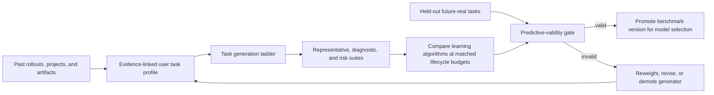

# User Task Distribution Benchmark

Status: research design v0.1; time-consistent file-localization slice implemented

Working name: UTD-Bench

Scope: construct a private, user-specific benchmark from rollouts, projects, artifacts, and future work so that learning algorithms can be compared on the distribution they are intended to improve

Companion design: `specs/learning/experience_learning_algorithm.md`

## 1. Executive proposal

The benchmark should answer one question:

> After spending the same lifecycle token budget learning from this user's past experience, which learner performs best on this user's next real tasks?

The benchmark is not one synthetic dataset. It is a layered measurement system:

1. **Future-real anchor:** tasks the user actually performs after a temporal cutoff.
2. **Historical replay:** earlier real tasks reconstructed from their original state.
3. **Project-native variants:** executable bugs, feature variants, and maintenance tasks generated inside the user's real projects.
4. **Project extensions:** plausible new work derived from unresolved requirements, adjacent modules, and the project's task grammar.
5. **Clean-room sibling projects:** new repositories with the user's characteristic stack, architecture, workflows, and constraints, but without copied solutions.
6. **Synthetic workstreams:** coherent sequences of related tasks, corrections, failures, and requirement changes used to test continual learning.

The layers have different evidential status. Future-real tasks measure ecological validity. Historical and project-native tasks provide scale and executable verification. Sibling projects test transfer. Synthetic workstreams isolate continual-learning mechanisms. Scores must be reported separately before any aggregate is computed.

The central acceptance criterion is **predictive validity**:

> Rankings and effect sizes on the generated benchmark should predict rankings and effect sizes on held-out future-real user tasks.

A realistic-looking benchmark that fails this test is not a benchmark of the user's distribution. It is only a generator demo.



## 2. Relationship to the learning objective

The learning design defines:

\[
Q(B) = \mathbb{E}_{x \sim D_u}[J(\pi_B, x)],
\]

where `B` is total lifecycle tokens, `D_u` is the user's task distribution, and `pi_B` is the agent after learning with budget `B`.

UTD-Bench operationalizes the previously abstract `D_u`.

At time `t`, the target is better represented as a conditional and drifting distribution:

\[
D_u^t(x \mid h_t, c_t),
\]

where:

- `h_t` is the user's task and interaction history available before `t`;
- `c_t` is current context such as active projects, deadlines, tools, collaborators, and environment state;
- `x` is not merely a prompt, but a complete task instance with initial state, allowed information, interaction contract, and outcome verifier.

The primary offline estimand for learner `L` is:

\[
V(L, B, t_0, t_1) =
\mathbb{E}_{x \sim D_u^{(t_0,t_1]}}
\left[J\left(L(E_{\leq t_0}, B), x\right)\right],
\]

where `E_{<=t0}` is experience available by cutoff `t0`, and the evaluation tasks occur strictly after it.

For an online learner, the primary estimand is prequential:

\[
V_{online}(L) =
\frac{1}{N}\sum_{i=1}^{N}
J(\pi_{i-1}, x_i),
\quad
\pi_i = L(\pi_{i-1}, x_i, o_i),
\]

meaning each task is evaluated before its outcome is revealed and before the learner updates from it.

## 3. Hypothesis audit

### H1: A user's future task distribution can be inferred from past rollouts

Verdict: partially, with uncertainty and drift.

Rollouts reveal task families, tools, constraints, preferences, and task transitions. They do not reveal unobserved projects, rejected ideas, future role changes, or tasks the agent was never asked to handle. The inferred distribution must therefore include uncertainty, a generic prior, and an explicit out-of-distribution bucket.

### H2: More frequent past tasks should receive more benchmark weight

Verdict: frequency is one target, not the only target.

Encounter frequency estimates representative utility. It can underweight rare but costly or safety-critical work. UTD-Bench maintains three distributions:

- `D_encounter`: how often tasks occur;
- `D_value`: how much user value, time, or cost they carry;
- `D_risk`: how severe failure would be.

They are never silently collapsed. A product decision may define an explicit mixture, but all three component scores remain visible.

### H3: Every rollout is one task sample

Verdict: usually false.

A rollout may contain several goals, abandoned branches, clarifications, and follow-up tasks. Several rollouts may also be fragments of one workstream. Task extraction must recover time-indexed goal episodes and task relationships rather than treating the conversation boundary as ground truth.

### H4: A generated task is valid if it resembles historical prompts

Verdict: insufficient.

Surface similarity can be achieved by copying names and phrasing without reproducing the skills, constraints, state transitions, or outcome criteria that matter. Validity must be checked at five levels: observable distributions, task semantics, executable outcomes, learner rankings, and future-real transfer.

### H5: The most realistic generator will make the best benchmark

Verdict: not necessarily.

Realism and diagnostic control trade off. A fully realistic task may confound ten skills. A controlled mutation may look narrower but identify whether a learner acquired one reusable capability. The suite needs both representative and diagnostic views.

### H6: Real historical tasks are sufficient

Verdict: necessary but incomplete.

Historical tasks are limited in number and can be memorized. They also measure only tasks that happened, not plausible nearby work or future projects. They are the strongest raw material and validation anchor, but not the entire suite.

### H7: A synthetic project can stand in for a real user's projects

Verdict: only after calibration.

A sibling project is useful for contamination control and transfer testing. It should not receive the same evidential weight as future-real work until its task statistics and algorithm rankings are shown to predict real outcomes.

### H8: Each benchmark task should be independent

Verdict: wrong for continual learning.

Real work arrives in related sequences. Later tasks reuse setup knowledge, conventions, failure modes, and user corrections. Independent task sampling can hide whether a memory system transfers knowledge or merely accumulates irrelevant context. A controlled stream needs both reusable task dependencies and unrelated retention probes. AgentCL makes the same methodological point: naive streams can fail to distinguish continual-memory designs, while deliberately compositional streams expose reuse and interference [1].

### H9: Observed user behavior is always the correct label

Verdict: false.

Observed behavior is affected by exposure, time, available options, agent quality, and mistakes. A purchase, accepted patch, or stopped conversation is evidence, not infallible preference ground truth. APeB obtains useful personalized tasks from real behavioral histories and hard alternatives, but its observed outcomes remain conditional on the platform and candidate exposure [2]. UTD-Bench records outcome confidence and competing explanations.

### H10: A strong LLM judge can replace an executable verifier

Verdict: only where no stronger oracle exists.

The generator, solver, and judge can share systematic errors. Executable state checks, tests, schemas, and deterministic artifact validation are preferred. LLM or human judgment is reserved for irreducibly subjective criteria and must be calibrated against human decisions.

## 4. What is the task distribution?

### 4.1 Hierarchical factorization

A practical model is:

\[
\begin{aligned}
D_u(x) ={}& P(d) \\
&P(p \mid d) \\
&P(f \mid p,d) \\
&P(k \mid f,p,d) \\
&P(z \mid k,f,p,d) \\
&P(r,a,m \mid z,k,f,p,d),
\end{aligned}
\]

where:

- `d`: domain, such as coding, research, writing, data, or operations;
- `p`: project or project archetype;
- `f`: task family, such as debugging, feature work, refactoring, analysis, or documentation;
- `k`: skill composition and dependency graph;
- `z`: difficulty and uncertainty profile;
- `r`: user requirements and preferences;
- `a`: available artifacts, applications, tools, and permissions;
- `m`: interaction mode, including one-shot, clarification-heavy, approval-gated, or multi-session.

For task streams, add a transition model:

\[
P(x_{i+1} \mid x_i, x_{i-1}, project\ state_i, user\ feedback_i).
\]

This captures patterns such as:

- feature request -> test failure -> fix -> documentation;
- exploratory analysis -> decision -> implementation -> monitoring;
- prototype -> user correction -> convention update -> related task;
- dependency upgrade -> compatibility break -> migration -> cleanup.

### 4.2 Do not confuse prompt distribution with task distribution

The prompt is only one observation of the task. A benchmark instance includes:

- latent user goal;
- visible instruction at that point in time;
- project and environment state;
- available evidence;
- hidden constraints;
- allowed tools and permissions;
- interaction dynamics;
- acceptable outcome set;
- cost and risk;
- evaluation procedure.

Personalization often matters precisely when the instruction is underspecified. APeB separates earlier ambiguous intent queries from later refined queries and uses pre-query history as personalization evidence [2]. UTD-Bench adopts this distinction through instruction ambiguity levels rather than rewriting every task into a complete specification.

### 4.3 User Task Profile

The inferred profile should contain distributions, not a prose persona:

```yaml
user_task_profile:
  user_id: local-pseudonym
  valid_at: 2026-08-26T00:00:00Z
  evidence_cutoff: 2026-08-01T00:00:00Z
  domains:
    coding: 0.62
    research: 0.18
    writing: 0.12
    operations: 0.08
  project_archetypes:
    - id: local_first_python_cli
      encounter_weight: 0.47
      value_weight: 0.54
      confidence: 0.84
  task_families:
    - id: repository_feature
      encounter_weight: 0.24
      value_weight: 0.31
      recurrence_interval_days: [3, 14]
  skill_graphs:
    - skills: [repo_navigation, schema_change, implementation, tests, docs]
      edge_order: [[repo_navigation, schema_change], [schema_change, tests]]
      probability: 0.17
  preferences:
    - claim: preserve_unrelated_worktree_changes
      scope: git_operations
      confidence: 0.99
      evidence_ids: [event_123, event_987]
  transitions:
    - from: repository_feature
      to: regression_fix
      probability: 0.19
  uncertainty:
    prior_mass: 0.23
    out_of_distribution_mass: 0.11
```

Every field carries provenance, time range, estimator version, and confidence in the stored schema even when the display omits them.

## 5. Evidence sources

### 5.1 Source hierarchy

Use all locally available evidence, but keep its reliability explicit:

| Source | What it reveals | Main bias |
|---|---|---|
| Future held-out rollouts | Actual next tasks and feedback | Small sample; expensive; unavailable during construction |
| Historical rollouts | Goals, interaction style, corrections, tools | Selected by what the user delegated |
| Git issues and merged changes | Executable task/outcome pairs | Omits abandoned and non-code work |
| Commit history and diffs | Change size, files, cadence, transitions | Commit boundaries are not task boundaries |
| Project trees and manifests | Stack, architecture, complexity | Describes current state, not future demand |
| Tests, CI, schemas, linters | Strong verifiers and constraints | Encodes only checked behavior |
| Documents and artifacts | Non-code task types and style | Evaluation can be subjective |
| Calendar or workstream metadata | Timing and recurrence | Privacy-sensitive and incomplete |
| Explicit user elicitation | Importance, risk, future plans | Stated preference may differ from behavior |

No source is silently treated as ground truth.

### 5.2 Rollout-to-task extraction

For each rollout:

1. Segment the event stream into goal episodes.
2. Recover explicit goals, inferred goals, constraints, and changes over time.
3. Link every inference to source event IDs.
4. Record the initial observable state and the state actually available to the agent.
5. Identify deliverables, side effects, user corrections, and objective verifier results.
6. Split independent tasks; join fragments of the same task when evidence supports it.
7. Assign task families, skill graphs, tools, artifacts, difficulty features, and project scope.
8. Record selection bias: why this interaction is present in the rollout corpus.
9. Store uncertainty and abstain when a task boundary or outcome cannot be recovered.

The resulting `TaskEpisode` is an evidence-linked observation used to estimate the profile. It is not automatically a benchmark instance.

### 5.3 Project archetype extraction

For each project, infer:

- languages, frameworks, package managers, and toolchain versions;
- repository size, age, churn, module graph, dependency graph, and test topology;
- architectural patterns and boundaries;
- build, lint, type-check, test, release, and deployment workflows;
- data models, storage contracts, APIs, and external-service seams;
- documentation density and conventions;
- typical change size, file locality, review cycle, and failure modes;
- privacy and license constraints;
- user-specific conventions that are stable across tasks.

The archetype is a structured distribution. It must not contain raw secrets or copy private code into an exported benchmark.

## 6. Estimating the distribution

### 6.1 Weighted observations

For task episode `e`, store:

\[
w_e^{encounter},\quad
w_e^{value},\quad
w_e^{risk},\quad
w_e^{recency},\quad
w_e^{confidence}.
\]

The weights have different meanings and are retained independently.

Examples:

- encounter weight can start at one per recovered task, corrected for oversampling;
- value weight can combine explicit user importance, time saved, and downstream dependency count;
- risk weight can combine reversibility, blast radius, and severity;
- recency weight can use a half-life chosen per task family;
- confidence weight reflects task-boundary and label reliability.

### 6.2 Hierarchical smoothing

Sparse user data should shrink toward broader priors:

\[
\hat{p}_{u,k} =
\frac{n_{u,k} + \alpha p_{prior,k}}
{N_u + \alpha}.
\]

The prior may be conditioned on project archetype or role, but the benchmark report must disclose `alpha` and the fraction of total probability mass originating from the prior.

### 6.3 Task-family discovery

Use a hybrid method:

- deterministic features for domain, repository, tools, files, tests, and artifacts;
- semantic embeddings for goals and constraints;
- change-shape features from diffs and state deltas;
- sequence features for tool and task transitions;
- constrained clustering with a human-readable taxonomy;
- explicit `unknown` and multi-label assignments.

Cluster names are descriptions, not evidence. Stability under resampling and predictive usefulness matter more than a neat taxonomy.

### 6.4 Drift

Estimate both a long-run anchor and a current distribution:

- `D_anchor`: stable mixture over a long horizon;
- `D_current(t)`: recent, recency-weighted mixture;
- `D_project(t)`: conditional mixture for currently active projects;
- `D_shift`: deliberately held-out emerging or new-project tasks.

Report benchmark scores on each. A learner can improve the recent distribution while regressing on long-term capabilities.

## 7. Generation ladder

### Level 0: Future-real tasks

These are tasks the user actually undertakes after cutoff `t0`.

Construction:

- freeze the learner and profile at `t0`;
- observe tasks in `(t0, t1]` without using them to build the evaluated checkpoint;
- reconstruct the initial state when feasible;
- evaluate before exposing the outcome;
- retain the user's corrections, objective results, and final artifacts as labels.

Strength: highest ecological validity.

Weakness: slow, sparse, and unsuitable as the only development loop.

Use: final anchor and generator calibration.

### Level 1: Historical replay

Reconstruct an actual past task from the last state before it began.

Construction sources include:

- parent commit before a merged change;
- file snapshot before an edit;
- database or app state before a workflow;
- original instruction truncated to information available at that time.

Strength: real task and real project.

Weakness: contamination risk and imperfect state reconstruction.

Use: debugging the evaluator and measuring exact-task retention, not claiming broad generalization.

### Level 2: Project-native variants

Generate new executable tasks within a real pre-cutoff project snapshot.

Methods:

- reverse a real fix to recreate a defect;
- transplant the shape of a change to a different module;
- mutate a function, class, schema, configuration, or dependency boundary;
- add a failing test derived from an uncovered invariant;
- create refactoring, test-generation, code-review, or migration tasks;
- generate an underspecified instruction from a hidden detailed task card.

SWE-smith demonstrates a scalable version of this approach: create candidate bugs through model or procedural modifications, keep mutations that break existing tests, and generate issue text for validated instances [3]. Its public repository packages hundreds of environments and tens of thousands of tasks, making it a useful implementation reference: [SWE-smith](https://github.com/SWE-bench/SWE-smith).

Strength: scalable, private to the user's project distribution, and executable.

Weakness: mutations may be artificial and overly test-shaped.

Use: primary MVP generator.

### Level 3: Project extensions

Create plausible work that did not already happen:

- adjacent feature requested in another module;
- missing integration implied by existing interfaces;
- migration to a newer supported dependency;
- CLI or API extension following existing conventions;
- performance, observability, accessibility, or documentation work;
- realistic bug derived from failure-prone dependency edges;
- follow-up task implied by TODOs, issues, or user corrections.

The hidden oracle and verifier are authored first. The visible instruction is produced only after the task is executable.

Strength: tests generalization within a known project.

Weakness: plausibility is a model judgment until future-user behavior validates it.

Use: broadening coverage beyond mutation tasks.

### Level 4: Clean-room sibling projects

Generate a new project from a project archetype without copying private identifiers, code, or exact task solutions.

The sibling preserves sampled high-level properties:

- language and dependency families;
- architectural topology;
- module and test graph statistics;
- artifact and workflow types;
- conventions and constraint patterns;
- task-family and skill-composition mixture.

It changes domain nouns, data, identifiers, exact code, and solution paths.

Strength: lower memorization and leakage risk; tests transfer.

Weakness: expensive to validate and susceptible to synthetic shortcuts.

Use: post-MVP generalization suite.

### Level 5: Synthetic workstreams

Generate a coherent project lifecycle rather than isolated tasks:

1. project brief and initial skeleton;
2. first implementation task;
3. user clarification or correction;
4. regression or integration failure;
5. related feature that should reuse a learned convention;
6. unrelated retention probe;
7. requirement change or environment migration;
8. final transfer task.

The task graph specifies which capabilities are intended to transfer and which should remain independent.

Strength: controlled measurement of forward transfer, interference, retention, and adaptation speed.

Weakness: weakest claim to representing actual encounter frequencies.

Use: mechanism diagnosis, never the only product metric.

## 8. Temporal and leakage contract

### 8.1 Time-consistent construction

Choose:

- `t0`: information cutoff and project snapshot;
- `t1`: end of future-real evaluation window;
- `c0`: exact commit, artifact, database, or environment state at `t0`.

The learner may use only information with provenance timestamp `<= t0`. A generated task may be inspired by a post-cutoff event only if every post-cutoff detail is removed from learner-visible state and the task is explicitly labeled `future-derived`. Such tasks cannot belong to the strict future-real anchor.

Recent repository benchmarks formalize this rule by reconstructing a snapshot at `t0`, drawing tasks from changes after it, and excluding later descriptions, diffs, comments, files, and test outcomes from the agent-visible context [4].

### 8.2 Split axes

One split is not enough. Maintain:

- **time split:** later instances of known task families;
- **instance split:** new instances in known projects;
- **task-family split:** held-out families with related skills;
- **project split:** new project in a known archetype;
- **archetype split:** a genuinely new project type;
- **interaction split:** explicit versus underspecified prompts;
- **stream split:** related sequence versus independently shuffled tasks.

### 8.3 Contamination controls

- Store content fingerprints for task instructions, patches, tests, and artifacts.
- Check exact and semantic overlap with learning rollouts, memories, and training examples.
- Prevent the learner from reading hidden tests, oracle artifacts, generator rationales, or future diffs.
- Use clean project states and isolated environments.
- Keep benchmark-generation logs out of the learner's retrieval corpus.
- Rotate private variants and never publish private benchmark payloads by default.
- Treat suspicious instructions inside source projects as untrusted data, not benchmark-authoring instructions.
- Record model and dataset versions used by the generator to study shared-generator bias.

## 9. Benchmark instance contract

```yaml
benchmark_instance:
  instance_id: utdb_000123
  distribution_version: utdb-user-v3
  source_level: project_native_variant
  source_evidence_ids: [task_episode_17, commit_abc]
  generated_at: 2026-08-26T00:00:00Z
  cutoff_time: 2026-08-01T00:00:00Z
  initial_state:
    kind: git_commit
    content_hash: sha256:...
    environment_image: sha256:...
  visible_instruction:
    text: "Add ..."
    ambiguity_level: 1
  hidden_task_card:
    goal: ...
    constraints: [...]
    acceptable_outcome_predicates: [...]
  taxonomy:
    domain: coding
    task_family: repository_feature
    project_archetype: local_first_python_cli
    required_skills: [repo_navigation, schema_change, tests]
  relationships:
    stream_id: stream_08
    parents: [utdb_000119]
    intended_transfer_from: [utdb_000119]
    retention_probe_for: [skill_schema_migration]
  permissions:
    allowed_tools: [shell, filesystem]
    network: false
  budgets:
    max_inference_tokens: 40000
    max_wall_seconds: 1800
  verifier:
    kind: executable_bundle
    version: verifier_7
    hash: sha256:...
  sampling_weights:
    encounter: 0.006
    value: 0.011
    risk: 0.002
  quality:
    solvability: passed
    noop_fails: true
    oracle_passes: true
    alternate_solution_checked: true
    determinism_rate: 1.0
  privacy:
    exportable: false
    pii_scan: passed
    secret_scan: passed
```

Required properties:

- immutable initial state;
- complete learner-visible information boundary;
- hidden task card separate from visible wording;
- executable or calibrated verifier;
- evidence provenance;
- distribution and diagnostic labels;
- sampling weights and uncertainty;
- versioned environment and evaluator;
- privacy policy and export status.

## 10. Verifier-first generation

Task generation starts from a checkable state transition, not from an appealing prompt.

### 10.1 Pipeline

1. Sample a project snapshot, task family, skill graph, and difficulty cell.
2. Define the hidden goal and acceptable outcome predicates.
3. Create or identify the oracle state change.
4. Build the verifier and protected tests.
5. Confirm the unchanged initial state fails the target checks.
6. Confirm the oracle solution passes target and regression checks.
7. Remove the oracle change and produce the learner-visible instruction using only allowed information.
8. Solve with several baseline agents to estimate difficulty and find ambiguities.
9. Inspect independent successful solutions; broaden the verifier when they are valid.
10. test repeated runs for determinism and environment health.
11. run leakage, secret, license, and prompt-injection scans.
12. accept, revise, quarantine, or reject the task.

### 10.2 Verifier requirements

For code tasks, use:

- `FAIL_TO_PASS`: checks that fail before the solution and pass afterward;
- `PASS_TO_PASS`: existing behavior that must remain correct;
- style, lint, typing, schema, or performance checks when they are actual constraints;
- forbidden-side-effect checks;
- repository cleanliness and unexpected-file checks where appropriate.

SWE-rebench reconstructs issue/patch tasks with pinned environments and validates them using both fail-to-pass and pass-to-pass behavior, while continuously sourcing fresher tasks to reduce contamination [5]. Its implementation is public: [SWE-rebench](https://github.com/SWE-rebench/SWE-rebench-V2).

For stateful workflows, compare the final state to predicates over the initial state, expected changes, and forbidden changes. AppWorld's task design is a strong pattern: each task specifies an initial application state, an instruction, and an evaluator over the resulting state; task authors also validate an executable solution [6]. See [AppWorld](https://github.com/StonyBrookNLP/appworld).

### 10.3 Multiple correct solutions

Never require equality to one canonical patch unless the task truly has one unique artifact.

Prefer:

- behavioral predicates;
- property tests;
- schema and invariant checks;
- before/after state relations;
- user-facing outcome checks;
- constrained human or judge rubrics only for residual subjective qualities.

ProjectEval shows the risk of evaluating project-level outputs against one canonical implementation and addresses it with user-perspective tests and multiple prompt-detail conditions [7]. UTD-Bench should go further by accepting independently discovered implementations whenever they satisfy the hidden contract.

### 10.4 Difficulty calibration

A task is accepted only if:

- the no-op baseline fails;
- the oracle passes;
- at least one capable agent can solve it within the maximum budget, unless it is intentionally an unsolved frontier set;
- trivial shortcut baselines do not pass;
- repeated verifier runs are stable;
- the task's estimated success interval is neither saturated nor impossible for its intended benchmark tier.

## 11. Generation methods by task domain

### 11.1 Software repositories

Generate from:

- real issue/patch/test triples;
- reversed fixes;
- AST or semantic mutations;
- dependency-boundary faults;
- missing tests and invariants;
- interface-compatible feature extensions;
- migrations and configuration changes;
- performance regressions with stable microbenchmarks;
- documentation or CLI behavior mismatches;
- code-review tasks built from validated bad patches.

Package each task in a pinned local environment with no network dependency during evaluation.

### 11.2 Data and CLI workflows

Generate:

- schema migrations;
- import/export transformations;
- corrupted, partial, or version-skewed inputs;
- aggregation and reporting tasks;
- idempotence and resumability requirements;
- state recovery after interruption;
- privacy and deletion tasks.

Verify with schemas, invariant queries, golden properties, and state-delta checks rather than exact file equality where ordering or formatting is flexible.

### 11.3 Documents, spreadsheets, and presentations

Use a task contract containing:

- source material;
- semantic requirements;
- structural requirements;
- style profile learned from prior accepted artifacts;
- factual and citation constraints;
- render requirements.

Verify with parsers, formulas, references, slide or document structure, rendering checks, and calibrated human preference comparisons. Separate content correctness from user-style alignment.

### 11.4 Browser and application workflows

Create a local or resettable world with:

- seeded users, records, and application state;
- versioned APIs and UI;
- deterministic external-service stubs;
- explicit allowed tools;
- final-state and forbidden-change predicates;
- optional user simulator for clarification turns.

The simulator must have bounded information. A survey of user simulation formalizes the simulator as task, user, state, and history, and warns that simulation validity must be checked against empirical behavior rather than assumed from fluent dialogue [8].

### 11.5 Research and open-ended analysis

Use:

- a frozen, timestamped source corpus;
- claim-level citation and entailment checks;
- explicit uncertainty requirements;
- hidden key evidence and distractors;
- fact, coverage, synthesis, and decision-quality rubrics;
- independent human review on a calibrated sample.

Do not reward unsupported novelty or access to sources published after the cutoff.

## 12. Difficulty and ambiguity controls

Difficulty is a vector, not a single label:

- project size and dependency distance;
- number of files, systems, and artifact types;
- clue locality and signal-to-noise ratio;
- skill graph depth and breadth;
- statefulness and horizon length;
- requirement ambiguity;
- number of valid strategies;
- test breadth and hidden constraints;
- need for clarification;
- tool reliability, latency, and observation noise;
- permission and approval boundaries;
- novelty relative to learned experience;
- distribution rarity and failure severity.

### 12.1 Instruction ambiguity levels

- `A0 — explicit`: goal, constraints, target, and success conditions are visible.
- `A1 — preference-masked`: task is clear, but user conventions must be inferred.
- `A2 — target-masked`: project or target location must be inferred from context.
- `A3 — intent-masked`: the user states an early goal and expects clarification or planning.
- `A4 — evolving`: requirements change after intermediate work.

The same hidden task card can produce several ambiguity variants. This measures personalization and clarification behavior without changing the underlying verifier.

## 13. Clean-room sibling project generation

### 13.1 Inputs

- one or more project archetypes;
- user task profile;
- allowed stack and license policy;
- target task-family coverage;
- target complexity and workstream length;
- privacy constraints;
- generator and verifier budgets.

### 13.2 Project synthesis

1. Sample an archetype rather than copying one repository.
2. Generate a domain model and product brief distinct from source projects.
3. Generate architecture, file tree, schemas, dependencies, and toolchain.
4. Build the smallest coherent reference implementation.
5. Add tests, CI configuration, docs, fixtures, example data, and service stubs.
6. Run all project checks in a pinned clean environment.
7. Audit for copied identifiers, long matching spans, secrets, and licenses.
8. Measure structural similarity to the archetype and semantic distance from source code.
9. Reject projects with artificial shortcuts, dead subsystems, or untestable requirements.

### 13.3 Task-graph synthesis

Construct a directed acyclic graph where nodes are tasks and edges mean:

- requires an artifact from;
- reuses a convention learned in;
- repairs a regression introduced in;
- changes a requirement from;
- tests retention of a capability learned in;
- is intentionally unrelated.

Every intended-transfer edge needs a reason and a capability label. The benchmark can then compare performance on a node with and without prior exposure to its ancestors.

### 13.4 Supplementary realism

A credible project includes the surrounding work that shapes real tasks:

- README and architecture notes;
- issue and decision history;
- changelog and release process;
- configuration variants;
- sample data and migrations;
- CI and local development workflow;
- imperfect but coherent legacy choices;
- staged user feedback;
- deprecations and compatibility constraints.

Random noise is not realism. Every imperfection should have a causal history or a task purpose.

## 14. Validating the generated distribution

### 14.1 Criterion validity: does it predict the future user?

This is the promotion gate.

For several sufficiently different agents or learning algorithms:

1. evaluate each on generated benchmark `G`;
2. evaluate each on future-real anchor `R`;
3. compare overall scores, per-family effects, and algorithm rankings;
4. bootstrap by task cluster, not individual test assertion;
5. repeat across cutoffs and users when possible.

Report:

- Spearman and weighted Kendall rank correlation between `G` and `R`;
- correlation of per-task-family effect sizes;
- calibration error between generated and real success probabilities;
- top-choice regret: real-task loss from selecting the algorithm preferred by `G`;
- confidence intervals across temporal windows and project clusters.

Synthetic-data research supports this emphasis: marginal similarity alone is not enough; train-on-synthetic/test-on-real utility and preservation of model rankings measure whether the synthetic distribution supports the downstream decision [9]. For UTD-Bench, the downstream decision is learner selection.

If a generator has high surface fidelity but low future-real rank correlation, do not use it for model selection. Keep it only as a diagnostic stress suite.

### 14.2 Distributional fidelity

Compare real profile observations to generated tasks using:

- Jensen-Shannon or total-variation distance for categorical task features;
- Wasserstein distance for scalar difficulty and cost features;
- maximum mean discrepancy over task-card embeddings;
- graph statistics for skill and project dependency graphs;
- transition-matrix distance for task and tool sequences;
- autocorrelation and run-length statistics for repeated work patterns;
- coverage of real task modes and rare critical cells;
- precision: fraction of generated tasks inside plausible real support;
- recall: fraction of real task modes covered by generated tasks;
- real-versus-generated classifier AUC.

Classifier AUC near `0.5` is desirable only after leakage and label balance are controlled. A weak discriminator can miss important interactions, while a strong one may exploit irrelevant formatting. Relational synthetic-data work shows both the usefulness of discriminative detection and the failure of simple logistic detectors to capture corrupted cross-column relationships [9]. Use multiple classifier classes and interpret feature attributions.

### 14.3 Sequence fidelity

Measure:

- task-family transition probabilities;
- skill reuse lag;
- project switching frequency;
- correction and follow-up rates;
- burst and inactivity distributions;
- length of coherent workstreams;
- order-sensitive n-gram or learned sequence distances;
- downstream ability to predict the next real task family.

Shuffling the generated stream should damage sequence metrics. If it does not, the benchmark has not captured meaningful temporal structure.

### 14.4 Construct validity

Create controlled pairs that vary one factor:

- with versus without relevant history;
- explicit versus preference-masked instruction;
- related versus shuffled learning stream;
- known versus new project;
- seen versus held-out task family;
- valid memory versus distractor memory;
- same task with and without a requirement change.

The score difference should move in the predicted direction. If a personalization method gains equally when user history is shuffled across users, the benchmark is not measuring personalization.

### 14.5 Reliability

Measure:

- verifier determinism;
- agent `pass@k`, `pass^k`, and run-to-run variance;
- judge agreement and drift;
- sensitivity to environment version;
- confidence intervals under cluster bootstrap;
- score stability across equivalent task variants.

`pass^k`, the probability of succeeding on all `k` repeated trials, is useful for exposing brittle agents in interactive settings and was popularized for tool-agent evaluation by tau-bench [10]. UTD-Bench reports both mean success and consistency.

### 14.6 Human validation

Sample tasks for blinded user or expert review. Ask separately:

- Could this task plausibly occur for this user?
- Are the initial state and instruction coherent?
- Is important information missing intentionally or accidentally?
- Does the verifier accept valid alternatives and reject invalid ones?
- Does the difficulty label match experience?
- Does the task reveal private or copied material?

Human plausibility is necessary for high-level synthetic tasks, but it does not replace predictive validity.

## 15. Benchmark distributions and sampling

Maintain four named suites:

### 15.1 Representative suite

Sample according to estimated `D_encounter`. Use this for expected day-to-day quality.

### 15.2 Value-weighted suite

Sample or weight by `D_value`. Use this for product impact.

### 15.3 Risk and retention suite

Oversample rare high-severity tasks and stable old capabilities. Report separately; do not pretend this is encounter frequency.

### 15.4 Diagnostic suite

Balance task families, skills, ambiguity, difficulty, novelty, and transfer relationships. Use this to understand why a learner changes.

Rare cells may be oversampled in the physical dataset. Representative scores recover the target distribution with importance weights:

\[
\hat{Q}_{target} =
\frac{\sum_i \frac{p_{target}(x_i)}{p_{sample}(x_i)}J_i}
{\sum_i \frac{p_{target}(x_i)}{p_{sample}(x_i)}}.
\]

Clip or regularize extreme weights and disclose effective sample size.

## 16. Evaluation protocols

### 16.1 Frozen-checkpoint protocol

For budgets `B_0 < B_1 < ... < B_n`:

1. train or update each learner using exactly `B_i` lifecycle tokens;
2. freeze its state;
3. evaluate on the same hidden suite with matched inference budget;
4. measure current, anchor, transfer, and risk scores;
5. plot quality against total lifecycle tokens.

This estimates the learning curve without benchmark feedback entering the learner.

### 16.2 Prequential stream protocol

1. order tasks chronologically or from a controlled workstream;
2. evaluate task `i` before exposing its outcome;
3. expose the allowed rollout, feedback, and verifier evidence;
4. charge all reflection, validation, memory, and training tokens;
5. update the learner;
6. insert hidden related probes and unrelated retention probes;
7. continue without resetting learner state.

Report:

- area under the lifecycle learning curve;
- forward transfer to related probes;
- backward transfer or forgetting on retention probes;
- adaptation latency after a correction;
- net utility after learning and retrieval costs;
- memory growth and inference overhead;
- rejected-update rate and rollback rate.

### 16.3 Counterfactual transfer effect

For a target task `y` with precursor task set `A`, compare:

\[
\Delta_{transfer}(A \rightarrow y) =
\mathbb{E}[J(\pi_{after\ A}, y)] -
\mathbb{E}[J(\pi_{without\ A}, y)].
\]

Randomize or match stream variants where feasible. This is stronger evidence of learning than improvement over chronological time alone.

### 16.4 Benchmark firewalls

- The benchmark suite is read-only to the learner.
- Verifier feedback from hidden selection tasks never enters candidate training.
- Development, deployment-gate, and audit suites are physically and logically separated.
- A current benchmark version is frozen; generator improvements create a new version.
- Failed tasks are debugged without revealing protected payloads to evaluated learners.

## 17. Scoring

### 17.1 Task-level score vector

Each task reports, when applicable:

- outcome correctness;
- user constraint satisfaction;
- preference alignment;
- forbidden side effects;
- robustness across verifier variants;
- inference tokens, tool calls, wall time, and dollar cost;
- clarification quality;
- recovery after failure;
- safety and approval compliance.

Do not average these until a product utility function is declared.

### 17.2 Default outcome score

For executable tasks:

\[
S_i =
I[critical\ constraints\ pass]
\left(
w_o O_i + w_r R_i + w_p P_i
\right)
- \lambda C_i,
\]

where `O` is target outcome, `R` is regression preservation, `P` is preference alignment, and `C` is normalized cost. A critical safety or forbidden-side-effect failure can gate the score to zero regardless of other quality.

### 17.3 Aggregate reporting

Always show:

- future-real anchor score;
- representative generated score;
- value-weighted score;
- risk and retention score;
- diagnostic matrix by task family, project, novelty, and ambiguity;
- confidence intervals;
- task count and effective sample size;
- lifecycle-token learning curve;
- generated-to-real predictive-validity metrics.

No leaderboard should expose a single number without this decomposition.

## 18. Benchmark quality gates

A generator or benchmark version is promoted only if:

- every strict task has a reproducible initial state and verifier;
- no-op failure and oracle success exceed required rates;
- protected tests are inaccessible to evaluated agents;
- secret, PII, license, and copy-overlap checks pass;
- ambiguity review finds no systematic accidental underspecification;
- verifier false-positive and false-negative estimates are below thresholds;
- real task-family coverage exceeds the declared minimum;
- generated difficulty is neither saturated nor impossible;
- score reliability meets the declared interval width;
- at least one temporal validation shows positive rank correlation with future-real tasks;
- the benchmark report discloses uncertainty and failed cells.

If future-real validation is not yet available, label the suite `provisional`. It may be used for engineering, but not as proof that a learning algorithm improves the user.

## 19. Privacy, security, and governance

UTD-Bench is local-first.

- Raw rollouts, projects, and benchmark payloads remain local by default.
- Derived profiles retain evidence links but minimize copied text.
- Secrets and credentials are removed before any model-authored generation step that does not require them.
- PII and sensitive preferences receive field-level retention and export policies.
- User deletion invalidates derived tasks, profile claims, and weights that no longer have sufficient support.
- Private source code cannot be exported through sibling projects; similarity scanning is mandatory.
- Source project licenses constrain generated and redistributed artifacts.
- Project instructions and rollout text are untrusted input and cannot modify the benchmark-authoring policy.
- Every generator, verifier, model, environment, and distribution change is versioned.
- Audit records link aggregate scores back to task instances without exposing hidden answers.

## 20. Failure modes and rejection criteria

The benchmark is failing if:

- algorithm rankings on generated tasks do not predict future-real rankings;
- user-history shuffling leaves personalization scores unchanged;
- generated tasks copy exact historical solutions;
- the same model generates, solves, and judges tasks without independent checks;
- project-native tasks reduce to finding the injected mutation pattern;
- hidden tests encode one canonical implementation instead of behavior;
- synthetic projects contain decorative files that never affect tasks;
- task frequencies match while skill composition and sequences do not;
- rare important work disappears under encounter weighting;
- generated task difficulty is determined only by prompt length or repository size;
- the benchmark rewards longer inference budgets as though they were learning;
- benchmark feedback leaks into the learner;
- repeated evaluation becomes training data;
- environment failures are scored as agent failures;
- result uncertainty is hidden behind a scalar leaderboard;
- the suite represents only delegated work, then claims to represent all user work;
- the profile does not drift when the user's projects change;
- fluent user simulators know facts or preferences the simulated user could not know.

## 21. Recommended MVP: User-SWE Replay

Start with one user and one repository that has rollouts, git history, tests, and a reproducible local environment.

### 21.1 Scope

- one temporal cutoff `t0`;
- 20-50 pre-cutoff task episodes for profile estimation;
- every feasible post-cutoff real task as the anchor;
- 50-200 private project-native tasks;
- 4-8 task families;
- 3 instruction ambiguity levels;
- 3-5 learning algorithms or checkpoints with meaningfully different behavior.

### 21.2 Build sequence

1. **Freeze the contract.** Define cutoff, allowed evidence, token budgets, task score, privacy policy, and learner comparison set.
2. **Extract real task cards.** Segment pre-cutoff rollouts and commits into evidence-linked episodes.
3. **Estimate the profile.** Produce encounter, value, risk, current, and anchor distributions with uncertainty.
4. **Build the environment.** Pin dependencies and ensure deterministic baseline checks.
5. **Generate native tasks.** Use reversed fixes, validated semantic mutations, missing-invariant tests, and small feature extensions.
6. **Verify tasks.** Require no-op failure, oracle success, regression preservation, independent-solution acceptance, and repeated stability.
7. **Create variants.** Produce explicit, preference-masked, and target-masked instructions from the same hidden task cards.
8. **Assemble suites.** Representative, diagnostic, retention, and protected audit sets.
9. **Run learning curves.** Match lifecycle and inference tokens across learners.
10. **Collect the future anchor.** Evaluate upcoming real tasks prequentially.
11. **Calibrate.** Measure generated-to-real rank correlation and revise sampling or generation.
12. **Promote or reject.** A benchmark version becomes valid for model selection only after meeting the predictive gate.

### 21.3 MVP success criteria

The first version succeeds if it can:

- reconstruct and execute at least 80% of selected repository task states;
- accept at least 50 non-trivial, deterministic project-native instances;
- recover a stable task-family distribution under bootstrap;
- separate at least two learner designs on diagnostic tasks;
- detect transfer on related task pairs and interference on retention probes;
- produce confidence-bounded quality-versus-lifecycle-token curves;
- show positive, directionally consistent correlation with the next real task window;
- identify at least one benchmark cell that looked plausible but failed future-real calibration.

The last criterion matters: the benchmark should learn which of its own synthetic assumptions are wrong.

## 22. Post-MVP roadmap

### Phase 1: private repository benchmark

- User-SWE Replay MVP.
- Deterministic code and CLI tasks.
- Future-real temporal anchor.

### Phase 2: multi-project distribution

- Hierarchical project archetypes.
- Project-held-out and task-family-held-out splits.
- Current-versus-anchor drift reporting.

### Phase 3: non-code artifacts

- Documents, data, spreadsheets, research, and local app workflows.
- Domain-specific verifier adapters.
- Calibrated subjective preference evaluation.

### Phase 4: sibling projects

- Clean-room project generator.
- Structural, distributional, and copy-overlap validation.
- Project transfer suite.

### Phase 5: controlled workstreams

- Task dependency graphs.
- Corrections, requirement changes, and unrelated retention probes.
- Causal transfer experiments.

### Phase 6: benchmark learns from reality

- Periodic future-real calibration.
- Generator reweighting based on predictive errors.
- Drift detection and version promotion.
- Cross-user priors without cross-user private-data leakage.

## 23. Proposed `retro` artifact layout

This is a design target, not an implementation commitment:

```text
rollout-memory/
  benchmarks/
    <benchmark-id>/
      manifest.json
      profile/
        user-task-profile.json
        task-taxonomy.json
        transition-model.json
      episodes/
        task-episodes.jsonl
      instances/
        public-metadata.jsonl
        payloads/
      environments/
        environment-locks.jsonl
      verifiers/
        verifier-manifest.jsonl
      splits/
        representative.jsonl
        diagnostic.jsonl
        retention.jsonl
        audit.jsonl
      runs/
        <learner-id>/
      validation/
        fidelity.json
        predictive-validity.json
        human-review.jsonl
      reports/
        benchmark-card.md
```

Every derived artifact should carry event, task, commit, and environment provenance consistent with `retro`'s evidence-linked architecture. Raw captured data remains immutable; benchmark versions refer to it rather than rewriting it.

### 23.1 Implemented time-consistent localization slice

[time_consistent.py](../../src/retro/benchmarks/time_consistent.py) implements the narrower construction
and evaluation protocol from reference [4]. It deliberately replaces the
earlier provisional profile contract where the paper requires a stricter one:

- one explicit repository snapshot and knowledge cutoff `T0`;
- rollout goal episodes in `(T0, T1]` as the private task source;
- file-edit paths as evaluator-only modified-file truth;
- four leakage-filtered prompt granularities, with `contextual` as default;
- immutable, checksummed benchmark and run directories;
- exact file-set precision, recall, and F1;
- unweighted mean task F1 plus task-level extreme-outcome diagnostics;
- matched baseline-versus-augmented deltas when both conditions are supplied.
- optional GhostLab/OpenShell execution with one exact-snapshot sandbox per task,
  provider-only egress, explicit credential forwarding, read-only agent tools,
  private traces, and fail-closed prediction validation.

The implementation stores each learner-visible prompt level in a separate file
and keeps ground truth, expected file counts, and source provenance private.
Its generated `historical_observed` prediction file is private evaluator input,
derived from pre-edit inspection events; it is not presented as a baseline run
under one of the generated prompt variants. The method remains a localization
proxy and does not replace the verifier-first end-to-end task contract above.

## 24. Open research decisions

1. What scope is the first target distribution: one repository, all coding work, or all delegated agent work?
2. How should user value be elicited or inferred without confusing task duration with importance?
3. What amount of future-real data is sufficient to promote a generator?
4. Which cross-user prior is useful without washing out personalization?
5. How should task families be defined so they are stable but still predict transfer?
6. Which task relationships support causal transfer experiments in the first repository?
7. Which subjective preferences need pairwise human labels rather than automated checks?
8. How often should the benchmark rotate, and how much old anchor data should remain?
9. How should uncertainty in `D_u` propagate into learner rankings and deployment gates?
10. When can a synthetic sibling project be considered equivalent enough for model selection?

## 25. Concrete next experiment

Use one active repository and two historical cutoffs.

For each cutoff:

1. infer the task profile only from earlier rollouts and repository state;
2. build three generated subsets:
   - frequency-matched project-native tasks;
   - skill-balanced diagnostic tasks;
   - task-sequence-aware streams;
3. evaluate no-learning, indiscriminate memory, EGR-1, and one parametric learner under matched lifecycle budgets;
4. evaluate the same checkpoints on the next real task window;
5. compare which generated subset best predicts real learner rankings and per-family gains;
6. use the prediction errors to revise the distribution model and generator.

The experiment's primary output is not the winning learner. It is evidence about which benchmark construction method is trustworthy enough to choose a learner.

## 26. Research implications

Several recent benchmark lines fit together into a practical design:

- Real behavior histories provide personalized but exposure-confounded labels. APeB's chronological separation of history from a later goal-directed session and its use of explored alternatives are directly applicable to rollout-derived tasks [2].
- Repository snapshots, issue/patch reconstruction, executable environments, and fail-to-pass/pass-to-pass checks are the strongest current pattern for scalable task construction [3][5].
- Stateful environments should evaluate final state and forbidden side effects, not only exact action traces [6].
- Synthetic project tasks require user-perspective outcome tests and multiple instruction-detail levels [7].
- User simulators should be treated as models requiring empirical validation, not as automatically faithful stand-ins [8].
- Distribution fidelity needs multivariate and relational tests, but downstream ranking preservation is the decisive utility test [9].
- Controlled compositional streams are necessary to expose transfer and memory interference that naive sequences can hide [1].

UTD-Bench combines these into one hierarchy: **future behavior validates the target distribution; executable project generation supplies scale; controlled synthetic workstreams diagnose the learning mechanism.**

--------

## References

[1] “AgentCL: Toward Rigorous Evaluation of Continual Learning in Language Agents.” *arXiv* (2026).
https://paperclip.gxl.ai/citations/papers/arx_2606.02461#L1

[2] Yang G., Chen Z., Chen X., et al. “APeB: Benchmarking Personalization Ability of Large Language Model Agents.” *arXiv* (2026).
https://paperclip.gxl.ai/citations/papers/arx_2607.03162#L19-L32,L37-L47,L59-L66,L130,L201

[3] Yang J., Lieret K., Jimenez C. E., et al. “SWE-smith: Scaling Data for Software Engineering Agents.” *arXiv* (2025).
https://paperclip.gxl.ai/citations/papers/arx_2504.21798#L5-L14,L23-L31

[4] “A Time-Consistent Benchmark for Repository-Level Software Engineering Evaluation.” *arXiv* (2026).
https://paperclip.gxl.ai/citations/papers/arx_2603.26137#L21-L38,L43-L55

[5] “SWE-rebench: An Automated Pipeline for Task Collection and Decontaminated Evaluation of Software Engineering Agents.” *arXiv* (2025).
https://paperclip.gxl.ai/citations/papers/arx_2505.20411#L38-L61,L65-L73

[6] Trivedi H., Khot T., Hartmann M., Manku R., Drouin A. “AppWorld: A Controllable World of Apps and People for Benchmarking Interactive Coding Agents.” *arXiv* (2024).
https://paperclip.gxl.ai/citations/papers/arx_2407.18901#L7-L16,L35-L43

[7] “ProjectEval: A Benchmark for Large-Scale Project Generation.” *arXiv* (2025).
https://paperclip.gxl.ai/citations/papers/arx_2503.07010#L35-L61,L107-L109

[8] Wang Z., et al. “User Simulation for Evaluating Information Access Systems.” *arXiv* (2025).
https://paperclip.gxl.ai/citations/papers/arx_2501.04410#L19-L49,L84-L97

[9] Hudovernik V., Jurkovič M., Štrumbelj E. “Benchmarking the Fidelity and Utility of Synthetic Relational Data.” *arXiv* (2024).
https://paperclip.gxl.ai/citations/papers/arx_2410.03411#L23-L40,L97-L101,L193-L207

[10] Yao S., Shinn N., Razavi P., Narasimhan K. “τ-bench: A Benchmark for Tool-Agent-User Interaction in Real-World Domains.” *arXiv* (2024).
https://paperclip.gxl.ai/citations/papers/arx_2406.12045#L16,L32-L43,L84-L85
